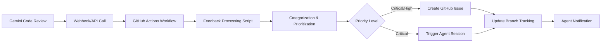

# Gemini Integration Workflow

## Overview

The Gemini Integration Workflow automates the conversion of Gemini Code Review comments into actionable GitHub issues with automatic agent session triggering for critical feedback. This system provides intelligent categorization, priority assignment, and seamless integration with the existing branch tracking system.

## Architecture



## Components

### 1. GitHub Actions Workflow
- **File**: `.github/workflows/gemini-code-review-integration.yml`
- **Trigger**: Repository dispatch events with type `gemini-code-review`
- **Purpose**: Orchestrates the entire feedback processing pipeline

### 2. Feedback Processing Script
- **File**: `agentic-development/scripts/process-gemini-feedback.js`
- **Purpose**: Categorizes feedback and determines appropriate actions
- **Features**:
  - Intelligent categorization (security, performance, architecture, etc.)
  - Priority assignment (critical, high, medium, low)
  - Agent assignment based on file patterns and feedback context

### 3. Agent Session Triggering
- **File**: `agentic-development/scripts/trigger-agent-session.js`
- **Purpose**: Automatically assigns tasks to appropriate agents for critical feedback
- **Integration**: Works with existing branch tracking system

### 4. Branch Tracking Integration
- **File**: Enhanced `agentic-development/scripts/update-branch-tracking.js`
- **Purpose**: Maintains visibility of Gemini feedback in the central tracking system
- **Features**: Tracks feedback history per branch, agent assignments, and status updates

## Feedback Categories

| Category | Priority | Auto Issue | Auto Agent | Description |
|----------|----------|------------|------------|-------------|
| `security-vulnerability` | Critical | ✅ | ✅ | Security issues requiring immediate attention |
| `performance-critical` | High | ✅ | ✅ | Performance problems affecting user experience |
| `architecture-concern` | High | ✅ | ❌ | Architectural design issues |
| `code-quality` | Medium | ✅ | ❌ | General code quality improvements |
| `documentation` | Low | ✅ | ❌ | Documentation improvements |
| `testing` | Medium | ✅ | ❌ | Testing coverage and quality |
| `best-practices` | Low | ❌ | ❌ | Code style and best practices |

## Priority Levels

### Critical Priority
- **Triggers**: Security vulnerabilities, exploits, injection attacks
- **Actions**: Immediate issue creation, agent session triggering, team notification
- **Response Time**: Immediate (within 1 hour)
- **Agent Assignment**: Automatic to security-focused agents (devops, vibe-coder)

### High Priority
- **Triggers**: Performance issues, architecture concerns, breaking changes
- **Actions**: Issue creation, optional agent triggering based on category
- **Response Time**: Within 24 hours
- **Agent Assignment**: Based on file patterns and expertise

### Medium Priority
- **Triggers**: Code quality, testing, refactoring suggestions
- **Actions**: Issue creation for tracking
- **Response Time**: Within normal development cycle
- **Agent Assignment**: Manual or batch processing

### Low Priority
- **Triggers**: Documentation, style, minor improvements
- **Actions**: Optional issue creation
- **Response Time**: As capacity allows
- **Agent Assignment**: Typically docs-orchestrator or vibe-coder

## Agent Assignment Rules

### File Pattern-Based Assignment
```javascript
const AGENT_ASSIGNMENT_RULES = {
  'frontend': {
    patterns: [/\.tsx?$/, /\.jsx?$/, /\.vue$/, /\.svelte$/],
    agents: ['react-dev', 'svelte-dev', 'node-dev']
  },
  'backend': {
    patterns: [/\.php$/, /controllers\//, /models\//, /api\//],
    agents: ['laravel-dev', 'node-dev']
  },
  'infrastructure': {
    patterns: [/docker/i, /\.yml$/, /terraform/, /deployment/],
    agents: ['devops']
  },
  'documentation': {
    patterns: [/\.md$/, /readme/i, /docs\//],
    agents: ['docs-orchestrator', 'vibe-coder']
  }
};
```

## API Integration

### Webhook Endpoint Structure
To trigger the workflow, send a `repository_dispatch` event to GitHub:

```bash
curl -X POST \
  https://api.github.com/repos/tuvens/tuvens-docs/dispatches \
  -H "Authorization: token $GITHUB_TOKEN" \
  -H "Accept: application/vnd.github.v3+json" \
  -d '{
    "event_type": "gemini-code-review",
    "client_payload": {
      "repository": "tuvens/repository-name",
      "branch": "feature/branch-name",
      "pull_request": 123,
      "commit_sha": "abc123def456",
      "title": "Security vulnerability in authentication",
      "description": "SQL injection risk in user login endpoint",
      "file_path": "src/controllers/AuthController.php",
      "line_numbers": "45-52",
      "suggestions": [
        "Use parameterized queries",
        "Implement input sanitization",
        "Add rate limiting"
      ]
    }
  }'
```

### Expected Payload Format
```typescript
interface GeminiFeedbackPayload {
  repository: string;           // "owner/repo"
  branch: string;              // Branch name
  pull_request?: number;       // Optional PR number
  commit_sha?: string;         // Optional commit hash
  title: string;               // Feedback title
  description: string;         // Detailed feedback
  file_path?: string;          // File location
  line_numbers?: string;       // Affected lines
  suggestions?: string[];      // Recommended actions
  fix_suggestions?: string[];  // Alternative suggestions format
}
```

## Agent Task Creation

When critical feedback triggers an agent session, the system creates:

### 1. Agent Task File
- **Location**: `agentic-development/{agent}/gemini-task-{session_id}.md`
- **Content**: Structured task instructions with context and success criteria

### 2. GitHub Issue
- **Labels**: `gemini-feedback`, `priority-{level}`, `category-{type}`, `{agent}`
- **Assignees**: Automatic for critical priority
- **Content**: Formatted feedback with recommendations and agent instructions

### 3. Branch Tracking Update
- **Status**: Updates branch status to reflect Gemini feedback
- **History**: Maintains feedback history per branch
- **Agent Assignment**: Records agent assignment and session details

## Usage Examples

### Manual Testing
```bash
# Test with workflow_dispatch
gh workflow run gemini-code-review-integration.yml \
  -f test_payload='{"repository":"tuvens/test","branch":"main","title":"Test feedback","description":"Testing the integration"}'
```

### Integration Testing
```bash
# Test feedback processing script directly
node agentic-development/scripts/process-gemini-feedback.js \
  --payload='{"repository":"tuvens/test","branch":"feature/test","title":"Security issue","description":"SQL injection vulnerability"}'

# Test agent session triggering
node agentic-development/scripts/trigger-agent-session.js \
  --repository="tuvens/test" \
  --branch="feature/test" \
  --agent="vibe-coder" \
  --issue="123" \
  --feedback-id="abc123" \
  --priority="critical"
```

## Monitoring and Logging

### Feedback History
- **File**: `agentic-development/branch-tracking/gemini-feedback.json`
- **Content**: Complete history of processed feedback with actions taken

### Agent Sessions
- **File**: `agentic-development/branch-tracking/agent-sessions.json`
- **Content**: Active and historical agent sessions triggered by feedback

### Branch Tracking
- **File**: `agentic-development/branch-tracking/active-branches.json`
- **Content**: Enhanced branch tracking with Gemini feedback status

## Configuration

### Environment Variables
```bash
# GitHub token for issue creation and repository access
TUVENS_DOCS_TOKEN=ghp_xxxxxxxxxxxxxxxxxxxx

# Optional: Webhook signature validation (future enhancement)
GEMINI_WEBHOOK_SECRET=your-secret-here
```

### Workflow Customization
Edit `.github/workflows/gemini-code-review-integration.yml` to:
- Adjust feedback processing parameters
- Modify agent assignment rules
- Add additional notification channels
- Customize issue templates

## Security Considerations

### Access Control
- Uses `TUVENS_DOCS_TOKEN` for GitHub API access
- Repository dispatch events require proper authentication
- Agent task files contain only non-sensitive information

### Data Validation
- Input validation in feedback processing script
- Sanitization of file paths and content
- Rate limiting considerations for high-volume feedback

### Privacy
- No sensitive code content stored in tracking files
- Feedback history includes only metadata and summaries
- Agent task files can be automatically cleaned up after completion

## Troubleshooting

### Common Issues

#### Workflow Not Triggering
1. Verify `repository_dispatch` event format
2. Check GitHub token permissions
3. Ensure workflow file is in correct location

#### Agent Sessions Not Created
1. Verify agent assignment rules
2. Check file path patterns
3. Ensure priority thresholds are met

#### Branch Tracking Issues
1. Validate repository/branch names
2. Check JSON file permissions
3. Review tracking script logs

### Debug Commands
```bash
# Check workflow runs
gh run list --workflow=gemini-code-review-integration.yml

# View specific run logs
gh run view [run-id] --log

# Test scripts locally
node agentic-development/scripts/process-gemini-feedback.js --help
node agentic-development/scripts/trigger-agent-session.js --help
```

## Future Enhancements

### Planned Features
- [ ] Webhook endpoint for direct integration (bypass repository_dispatch)
- [ ] Machine learning-based categorization improvements
- [ ] Integration with external notification systems (Slack, Discord)
- [ ] Automated feedback resolution tracking
- [ ] Performance metrics and analytics dashboard

### Integration Opportunities
- [ ] IDE plugin integration for real-time feedback
- [ ] CI/CD pipeline integration for automated code reviews
- [ ] Pull request status checks based on Gemini feedback
- [ ] Automated testing generation based on feedback suggestions

## Support

For issues or questions regarding the Gemini Integration Workflow:
1. Check the troubleshooting section above
2. Review GitHub Actions workflow logs
3. Examine branch tracking files for data consistency
4. Create an issue with the `gemini-integration` label

---

*Last Updated: 2025-08-08*  
*Version: 1.0*  
*Maintained By: Vibe Coder Agent*