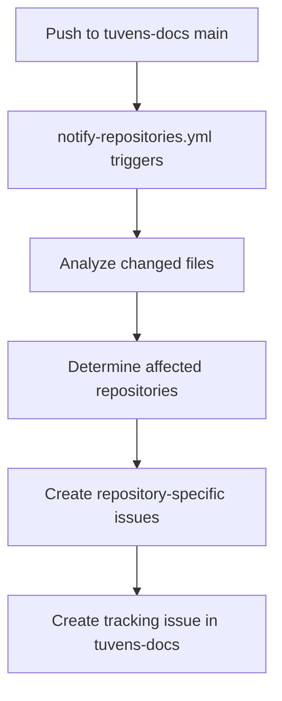
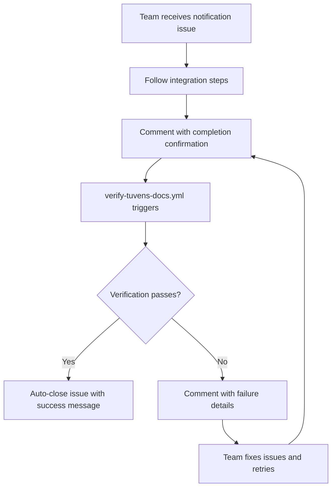

# Automated Documentation Update System

## 🎯 Overview

This directory contains the automated notification system for tuvens-docs changes. When documentation is updated, GitHub Actions workflows automatically create issues in consuming repositories with specific, actionable instructions.

## 🔧 How It Works

### 1. Automatic Notification (Phase 2)
When changes are pushed to `main` in tuvens-docs:

1. **`notify-repositories.yml`** workflow triggers on changes to:
   - `integration-guides/**`
   - `implementation-guides/**`
   - `shared-protocols/**`
   - `integration-examples/**`
   - `claude-templates/**`
   - `setup.sh`, `README.md`, `CONTRIBUTING.md`

2. **Change Analysis** determines what type of changes occurred:
   - Frontend changes → notify frontend repositories
   - Backend changes → notify backend repositories  
   - Integration changes → notify integration repositories

3. **Repository-Specific Issues** are created using tailored templates:
   - `frontend-notification.md` → eventdigest-ai, tuvens-client
   - `backend-notification.md` → tuvens-api
   - `integration-notification.md` → hi.events

4. **Tracking Issue** created in tuvens-docs to monitor integration status

### 2. Automatic Verification (Phase 2)
Consuming repositories can install the verification workflow:

1. Copy `agentic-development/cross-repo-sync-automation/templates/repository-verification-workflow.yml` to their `.github/workflows/` directory
2. When team members comment with completion confirmation, the workflow:
   - Verifies tuvens-docs is up to date
   - Checks required documentation files exist
   - Runs tests, linting, and type checking
   - Performs repository-specific verification
   - Automatically closes the issue if verification passes

## 📁 File Structure

**Note**: The `notify-repositories.yml` workflow has been moved to `.github/workflows/` at the repository root to enable GitHub Actions execution.

```
cross-repo-sync-automation/
├── templates/
│   ├── frontend-notification.md         # Frontend repository template
│   ├── backend-notification.md          # Backend repository template
│   ├── integration-notification.md      # Integration repository template
│   └── repository-verification-workflow.yml  # Template for consuming repos
└── README.md                           # This file
```

## 🚀 Setup Instructions

### For tuvens-docs Repository (Already Done)
The notification system is already set up and will trigger automatically on pushes to main.

### For Consuming Repositories (Manual Setup Required)

Each consuming repository should copy the verification workflow:

```bash
# In each repository (eventdigest-ai, tuvens-api, tuvens-client, hi.events)
mkdir -p .github/workflows
cp /path/to/tuvens-docs/agentic-development/cross-repo-sync-automation/templates/repository-verification-workflow.yml \
   .github/workflows/verify-tuvens-docs.yml
```

## 📋 Notification Templates

### Frontend Template Features
- **Technology Stack Verification**: Svelte/React, TypeScript, TailwindCSS compliance
- **Design System Checks**: Tuvens color palette and typography verification
- **Component Standards**: UI component architecture validation
- **Testing Requirements**: 80% coverage verification
- **Accessibility Compliance**: WCAG 2.1 AA requirements

### Backend Template Features  
- **API Endpoint Verification**: Cross-app authentication endpoints
- **Database Schema Checks**: Migration and schema compliance
- **Security Validation**: Authentication and authorization verification
- **Integration Testing**: Cross-app communication testing
- **Performance Requirements**: Response time validation

### Integration Template Features
- **Cross-App Flow Testing**: End-to-end authentication verification
- **Widget Integration**: Embed functionality testing
- **Event Synchronization**: Data sync verification
- **Security Protocols**: Cross-app security validation
- **Performance Monitoring**: Integration performance checks

## 🔄 Workflow Process

### 1. When Documentation Changes (Automatic)


### 2. When Teams Respond (Semi-Automatic)


## 📊 Monitoring

### Success Metrics
- **Notification Coverage**: 100% of relevant repositories notified within 1 hour
- **Response Time**: Average time from notification to completion <24 hours  
- **Success Rate**: >95% of repositories successfully integrate updates
- **Automation Rate**: >90% of verifications completed automatically

### Tracking
- **Tracking Issues**: Created in tuvens-docs for each update cycle
- **Workflow Logs**: Available in GitHub Actions for debugging
- **Issue Comments**: Automated verification results recorded in issues

## 🆘 Troubleshooting

### Common Issues

**Issue**: Notification not created
- **Cause**: Files changed don't match trigger paths
- **Solution**: Check `notify-repositories.yml` paths configuration

**Issue**: Verification workflow fails
- **Cause**: Repository structure doesn't match expected layout
- **Solution**: Review `repository-verification-workflow.yml` for path assumptions

**Issue**: Template placeholders not replaced
- **Cause**: Workflow environment variables not properly set
- **Solution**: Check workflow logs for variable substitution errors

### Debug Steps

1. **Check Workflow Logs**: GitHub Actions → tuvens-docs repository → notify-repositories workflow
2. **Verify File Paths**: Ensure changed files match trigger path patterns
3. **Test Templates**: Manually test template placeholder replacement
4. **Repository Structure**: Verify consuming repositories match expected structure

## 🔧 Customization

### Adding New Repository Types
1. Add repository to matrix in `notify-repositories.yml`
2. Create new template in `agentic-development/cross-repo-sync-automation/templates/`
3. Update change analysis logic for new repository type

### Modifying Notification Content
1. Edit appropriate template in `agentic-development/cross-repo-sync-automation/templates/`
2. Test with placeholder values
3. Verify formatting and actionability

### Adjusting Trigger Conditions
1. Modify `paths` section in `notify-repositories.yml`
2. Update change analysis logic if needed
3. Test with representative file changes

## 📝 Template Variables

All templates support these placeholders:
- `[CHANGED_FILES]` - Comma-separated list of changed files
- `[COMMIT_SHA]` - Short commit SHA of the update
- `[COMMIT_MESSAGE]` - Commit message for the update  
- `[REPO_NAME]` - Target repository name (e.g., tuvens/eventdigest-ai)

## 🚦 Status

- ✅ **Phase 1**: Enhanced manual notification templates
- ✅ **Phase 2**: Automated notification creation and verification  
- ❌ **Phase 3**: Fully automated repository updates (not implemented)

## 📞 Support

For issues with the automation system:
1. Check workflow logs in GitHub Actions
2. Review this README for common issues
3. Create issue in tuvens-docs with `automation` label
4. Include relevant workflow run URLs and error messages

---

*This automation system ensures all repositories stay synchronized with tuvens-docs changes while minimizing manual effort and errors.*