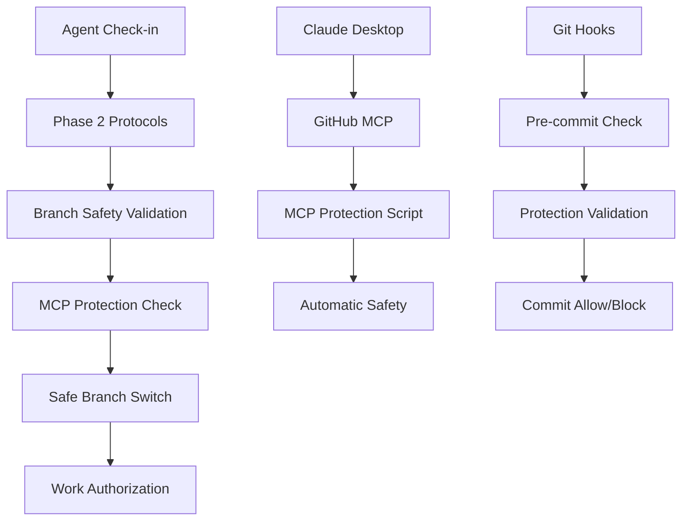

# Branch Safety Guide
## Comprehensive Guide to Phase 3 Branch Safety Implementation

**Version**: 1.0.0  
**Last Updated**: August 14, 2025  
**Part of**: Phase 3: Branch Safety Implementation - Orchestration System Development  
**Integration**: Phase 1 System Orchestrator + Phase 2 Protocol Framework  

---

## 📋 Table of Contents

1. [Overview](#overview)
2. [Safety Architecture](#safety-architecture)
3. [Core Safety Scripts](#core-safety-scripts)
4. [Agent Safety Protocols](#agent-safety-protocols)
5. [Claude Desktop Integration](#claude-desktop-integration)
6. [Usage Examples](#usage-examples)
7. [Troubleshooting](#troubleshooting)
8. [Emergency Procedures](#emergency-procedures)
9. [Integration Testing](#integration-testing)
10. [Maintenance and Updates](#maintenance-and-updates)

---

## Overview

The Phase 3 Branch Safety Implementation provides automated protection against dangerous branch operations in multi-agent development environments, with special focus on Claude Desktop session safety and GitHub MCP integration.

### 🎯 Key Objectives

- **Prevent Protected Branch Commits**: Block direct commits to main, stage, test branches
- **Claude Desktop Session Protection**: MCP-aware safety for desktop environment
- **Automated Branch Switching**: Intelligent safe branch creation and switching
- **Agent Coordination**: Integrate with Phase 1 & 2 orchestration protocols
- **Emergency Response**: Override procedures for genuine emergencies

### 🏗️ System Integration



---

## Safety Architecture

### 🔒 Multi-Layer Protection System

#### Layer 1: Pre-Work Validation
- **Script**: `branch-safety-validation.sh`
- **Purpose**: Validate environment before agent begins work
- **Triggers**: Agent check-in process, manual validation

#### Layer 2: MCP Protection
- **Script**: `github-mcp-protection.sh` 
- **Purpose**: Protect Claude Desktop sessions from dangerous operations
- **Triggers**: Git operations, MCP requests, session initialization

#### Layer 3: Git Hook Integration
- **Implementation**: Pre-commit, pre-push hooks
- **Purpose**: Last-line defense against protected branch commits
- **Triggers**: Git commit, Git push operations

#### Layer 4: Emergency Override
- **System**: Token-based emergency procedures
- **Purpose**: Allow overrides for genuine emergencies
- **Triggers**: Critical production issues, system recovery

### 🎯 Protection Scope

```bash
# Protected Branches (No Direct Commits)
PROTECTED_BRANCHES=("main" "stage" "test")

# Valid Agent Names
VALID_AGENTS=("vibe-coder" "docs-orchestrator" "devops" 
              "laravel-dev" "react-dev" "node-dev" "svelte-dev")

# Valid Task Types  
VALID_TASK_TYPES=("feature" "bugfix" "docs" "workflow" "hotfix" "refactor")
```

---

## Core Safety Scripts

### 1. Branch Safety Validation Script

**Location**: `agentic-development/scripts/branch-safety-validation.sh`

#### Purpose
Comprehensive pre-work validation to ensure safe development environment before agents begin work.

#### Key Features
- ✅ Protected branch detection and blocking
- ✅ Branch naming convention validation
- ✅ CLAUDE.md safety file verification
- ✅ Development environment checks
- ✅ Staging area safety analysis
- ✅ Pre-commit hook integration validation

#### Usage Examples

```bash
# Basic safety check
./agentic-development/scripts/branch-safety-validation.sh

# Expected output when safe:
🛡️  Branch Safety Pre-Work Validation v1.0.0
===============================================

Current branch: vibe-coder/feature/branch-safety-implementation
Working directory: /path/to/repository

1️⃣ Protected Branch Safety Check
----------------------------------
✅ Safe to work on branch: vibe-coder/feature/branch-safety-implementation

2️⃣ Branch Naming Convention Check
----------------------------------
✅ Branch naming follows conventions
ℹ️  Agent: vibe-coder | Type: feature | Description: branch-safety-implementation

📋 Branch Safety Validation Summary
------------------------------------
🎉 All critical safety checks passed!

🎉 Branch Safety Status: SAFE TO PROCEED
   Current Branch: vibe-coder/feature/branch-safety-implementation
   Agent can begin work following Phase 2 protocols
```

#### Error Scenarios

```bash
# Protected branch violation
❌ CRITICAL: Cannot work on protected branch 'main'

🛡️  Tuvens 5-Branch Strategy Violation:
   main ← stage ← test ← dev ← feature/*

✅ Required Workflow:
   1. Switch to 'dev' branch: git checkout dev
   2. Create feature branch: git checkout -b {agent}/{type}/{description}
   3. Make changes on feature branch
   4. Submit PR targeting 'dev' branch
```

### 2. GitHub MCP Protection Script

**Location**: `agentic-development/scripts/github-mcp-protection.sh`

#### Purpose
Specialized protection for Claude Desktop sessions using GitHub MCP, with automatic safe branch switching.

#### Key Features
- 🖥️ Claude Desktop environment detection
- 🔗 MCP transport layer monitoring
- 🔄 Automatic safe branch switching
- 🆘 Emergency override token generation
- 📊 Session tracking and violation logging
- 🪝 Git hook integration support

#### Usage Examples

```bash
# Initialize MCP protection session
./agentic-development/scripts/github-mcp-protection.sh --init-session vibe-coder "feature implementation"

# Run comprehensive MCP safety check
./agentic-development/scripts/github-mcp-protection.sh --check

# Attempt automatic safe branch switch
./agentic-development/scripts/github-mcp-protection.sh --auto-switch vibe-coder

# Generate emergency override token
./agentic-development/scripts/github-mcp-protection.sh --emergency "production hotfix required"
```

#### Automatic Branch Switching

When MCP protection detects a dangerous operation:

```bash
🖥️ Claude Desktop Environment Detection
----------------------------------------
✅ Claude Desktop environment detected
ℹ️  MCP server detected: github

🔄 Automatic Branch Safety Switch
----------------------------------
⚡ Attempting automatic branch switch to protect from MCP violation
ℹ️  Current unsafe branch: main
ℹ️  Target safe branch: vibe-coder/feature/mcp-safety-switch-20250814-143022

ℹ️  Switching to dev branch first...
✅ Switched to dev branch
ℹ️  Creating safe feature branch: vibe-coder/feature/mcp-safety-switch-20250814-143022
✅ Successfully switched to safe branch: vibe-coder/feature/mcp-safety-switch-20250814-143022

🎉 MCP Protection Applied Successfully
   Safe Branch: vibe-coder/feature/mcp-safety-switch-20250814-143022
   Agent can now proceed with work
```

---

## Agent Safety Protocols

### 🔄 Integration with Phase 1 & 2 Systems

#### Phase 1 System Orchestrator Integration
The branch safety system works seamlessly with the vibe-coder System Orchestrator role:

```markdown
## Enhanced Agent Check-in Protocol (Phase 3 Updated)

**Agent Identity**: I am [agent-name]
**Target Task**: [specific-task-description]
**Repository**: [repo-name]
**Current Location**: [output of `pwd`]
**Current Branch**: [output of `git branch --show-current`]
**File Scope**: Working on files: [specific-file-list]

**PHASE 3 BRANCH SAFETY CHECK**:
```bash
# Run automated branch safety validation
./agentic-development/scripts/branch-safety-validation.sh

# Expected output for safe environment:
✅ All critical safety checks passed!
🎉 Branch Safety Status: SAFE TO PROCEED
```

**Awaiting Vibe Coder Approval**: [REQUIRED RESPONSE]
```

#### Phase 2 Protocol Framework Enhancement
Branch safety protocols integrate with all Phase 2 procedures:

- **Agent Check-in Validation**: Enhanced with automated safety checks
- **GitHub Comment Standards**: Safety status reporting in comments
- **File Scope Management**: Branch safety as part of resource allocation
- **Emergency Response**: Escalation to branch safety emergency procedures

### 👤 Enhanced Agent Comment Protocol

```markdown
👤 **Identity**: [agent-name]
🎯 **Addressing**: vibe-coder
🛡️ **Branch Safety**: ✅ Validated | Branch: {agent}/{type}/{description}

[Agent communication content]
```

---

## Claude Desktop Integration

### 🖥️ Desktop Environment Detection

The MCP protection system automatically detects Claude Desktop environments through multiple indicators:

```bash
# Environment detection methods:
- CLAUDE_DESKTOP_SESSION environment variable
- MCP_SERVER_NAME detection  
- Claude process detection via pgrep
- MCP transport layer indicators (MCP_TRANSPORT, MCP_CLIENT_ID)
- Parent process analysis for Claude Desktop
```

### 🔗 MCP-Specific Safety Features

#### Session Tracking
```json
{
  "session_id": "1692041234-12345",
  "agent_name": "vibe-coder",
  "target_task": "feature implementation",
  "start_time": "2025-08-14T14:30:22-07:00",
  "current_branch": "vibe-coder/feature/branch-safety-implementation",
  "repository": "tuvens-docs",
  "protection_active": true,
  "violations": [],
  "last_check": "2025-08-14T14:35:45-07:00"
}
```

#### Violation Logging
```json
{
  "type": "MCP_PROTECTED_BRANCH_ACCESS", 
  "details": "main",
  "timestamp": "2025-08-14T14:35:45-07:00",
  "action_taken": "block_operation"
}
```

### 🔧 Git Hook Integration

#### Pre-commit Hook Setup
```bash
# Add to .git/hooks/pre-commit
#!/bin/bash
./agentic-development/scripts/github-mcp-protection.sh --pre-commit

# Make executable
chmod +x .git/hooks/pre-commit
```

#### Pre-push Hook Setup (Optional)
```bash  
# Add to .git/hooks/pre-push
#!/bin/bash
./agentic-development/scripts/github-mcp-protection.sh --check
```

---

## Usage Examples

### 📚 Common Workflows

#### 1. Agent Starting New Work Session

```bash
# Step 1: Run pre-work validation
./agentic-development/scripts/branch-safety-validation.sh

# Step 2: If using Claude Desktop, initialize MCP protection
./agentic-development/scripts/github-mcp-protection.sh --init-session vibe-coder "implement new feature"

# Step 3: Follow Phase 2 agent check-in protocol
# (Post GitHub issue comment with safety validation status)

# Step 4: Await vibe-coder approval
# Step 5: Begin work with safety protection active
```

#### 2. Handling Protected Branch Detection

```bash
# Scenario: Agent accidentally on protected branch
Current branch: main

# Automatic detection and guidance:
❌ CRITICAL: Cannot work on protected branch 'main'

# Recommended resolution:
git checkout dev
git checkout -b vibe-coder/feature/new-implementation

# Or use automatic switching:
./agentic-development/scripts/github-mcp-protection.sh --auto-switch vibe-coder
```

#### 3. Claude Desktop MCP Session

```bash
# Initialize protection for Claude Desktop
./agentic-development/scripts/github-mcp-protection.sh --init-session docs-orchestrator "documentation update"

# Claude Desktop automatically protected
# MCP operations monitored and validated
# Automatic branch switching if violation detected
```

### 🎯 Integration Testing Examples

#### Test Scenario 1: Valid Agent Workflow
```bash
# Setup test environment
git checkout dev
git checkout -b vibe-coder/feature/test-safety-implementation

# Run safety validation
./agentic-development/scripts/branch-safety-validation.sh
# Expected: ✅ All critical safety checks passed!

# Initialize MCP protection  
./agentic-development/scripts/github-mcp-protection.sh --init-session vibe-coder "testing"
# Expected: ✅ MCP protection session initialized for vibe-coder
```

#### Test Scenario 2: Protected Branch Violation
```bash
# Setup violation scenario
git checkout main

# Run safety validation
./agentic-development/scripts/branch-safety-validation.sh
# Expected: ❌ CRITICAL: Cannot work on protected branch 'main'

# Attempt MCP operation
./agentic-development/scripts/github-mcp-protection.sh --check
# Expected: 🚨 EMERGENCY: MCP attempting to operate on protected branch: main
```

---

## Troubleshooting

### 🔧 Common Issues and Solutions

#### Issue 1: Script Permission Denied
```bash
# Problem: -bash: permission denied
# Solution: Make scripts executable
chmod +x agentic-development/scripts/branch-safety-validation.sh
chmod +x agentic-development/scripts/github-mcp-protection.sh
```

#### Issue 2: MCP Environment Not Detected
```bash
# Problem: Standard terminal environment (non-Claude Desktop)
# Check: Verify Claude Desktop is running and MCP server active
# Solution: Set environment variables manually for testing:
export CLAUDE_DESKTOP_SESSION=true
export MCP_SERVER_NAME=github
```

#### Issue 3: Branch Naming Validation Failures
```bash
# Problem: ❌ Branch naming format violation
# Current: my-feature-branch
# Solution: Use correct format
git checkout -b vibe-coder/feature/my-feature-branch
```

#### Issue 4: CLAUDE.md Validation Errors
```bash
# Problem: ❌ CLAUDE.md file missing
# Solution: Ensure CLAUDE.md exists with required sections:
# - Critical Claude Code Safety Rules
# - Mandatory Branch Naming Conventions
# - Pull Request Target Branch Rules
# - Emergency Branch Recovery Procedures
# - Testing Protocol Requirements
```

### 🩺 Diagnostic Commands

```bash
# Check current safety status
./agentic-development/scripts/branch-safety-validation.sh

# Verify MCP protection system
./agentic-development/scripts/github-mcp-protection.sh --check

# Show active session information
./agentic-development/scripts/github-mcp-protection.sh --session-status

# Verify git hook integration
ls -la .git/hooks/pre-commit
ls -la .git/hooks/pre-push
```

---

## Emergency Procedures

### 🆘 Emergency Override System

#### When to Use Emergency Override
- **Production Critical Issues**: System down, immediate hotfix required
- **Repository Corruption**: Branch system damaged, recovery needed
- **Process Failure**: Safety scripts malfunction, blocking valid work
- **Time-Critical Situations**: External deadlines, emergency releases

#### Generate Emergency Override Token
```bash
./agentic-development/scripts/github-mcp-protection.sh --emergency "production hotfix required"

# Output:
🚨 EMERGENCY OVERRIDE GENERATED
   Token: EMERGENCY_1692041234_a1b2c3d4
   Reason: production hotfix required
   Branch: main
   Timestamp: 2025-08-14T14:30:22-07:00

⚠️  IMPORTANT WARNINGS:
   • Override bypasses all MCP protections
   • Use only for genuine emergencies
   • Document usage in incident report
   • Report to vibe-coder system orchestrator
```

#### Use Emergency Override
```bash
# Activate override (temporary)
export MCP_EMERGENCY_OVERRIDE="EMERGENCY_1692041234_a1b2c3d4"

# Perform emergency operation
git add .
git commit -m "Emergency hotfix: critical production issue"

# Deactivate override immediately after use
unset MCP_EMERGENCY_OVERRIDE
```

### 📋 Post-Emergency Procedures

#### Required Documentation
1. **GitHub Issue**: Create emergency incident report
2. **Override Justification**: Document reason and impact
3. **Recovery Plan**: Document how to prevent future occurrences
4. **Vibe-Coder Notification**: Report to system orchestrator

#### Example Emergency Report
```markdown
👤 **Identity**: [agent-name]
🎯 **Addressing**: vibe-coder
🚨 **Emergency Override Used**: EMERGENCY_1692041234_a1b2c3d4

## Emergency Incident Report

**Trigger**: Production system failure - database connection lost
**Override Reason**: Immediate hotfix required to restore service
**Branch**: main (direct commit required)
**Files Modified**: config/database.php
**Duration**: 15 minutes
**Impact**: Service restored, no data loss

**Recovery Actions**:
1. Fixed database configuration
2. Verified system functionality
3. Created proper feature branch for follow-up improvements
4. Updated monitoring to prevent recurrence

**Learning**: Add database connection monitoring to prevent future issues
```

---

## Integration Testing

### 🧪 Comprehensive Test Suite

#### Test 1: Basic Safety Validation
```bash
#!/bin/bash
# Test basic branch safety validation functionality

echo "Test 1: Basic Safety Validation"
echo "================================"

# Setup safe branch
git checkout dev
git checkout -b vibe-coder/feature/safety-test

# Run validation
./agentic-development/scripts/branch-safety-validation.sh

# Expected: All checks pass
echo "✅ Test 1 Complete"
```

#### Test 2: Protected Branch Detection
```bash
#!/bin/bash  
# Test protected branch detection and blocking

echo "Test 2: Protected Branch Detection"  
echo "=================================="

# Switch to protected branch
git checkout main

# Run validation (should fail)
if ! ./agentic-development/scripts/branch-safety-validation.sh; then
    echo "✅ Protected branch correctly detected and blocked"
else
    echo "❌ Protected branch detection failed"
fi

echo "✅ Test 2 Complete"
```

#### Test 3: MCP Protection System
```bash
#!/bin/bash
# Test MCP protection initialization and detection

echo "Test 3: MCP Protection System"
echo "============================="

# Initialize MCP session
./agentic-development/scripts/github-mcp-protection.sh --init-session test-agent "testing"

# Check session status  
./agentic-development/scripts/github-mcp-protection.sh --session-status

# Run safety check
./agentic-development/scripts/github-mcp-protection.sh --check

echo "✅ Test 3 Complete"
```

#### Test 4: Emergency Override System
```bash
#!/bin/bash
# Test emergency override generation and usage

echo "Test 4: Emergency Override System"  
echo "================================="

# Generate override token
./agentic-development/scripts/github-mcp-protection.sh --emergency "testing emergency procedures"

# Note: Do not activate override in automated tests
echo "⚠️  Emergency override token generated (test only - not activated)"

echo "✅ Test 4 Complete"  
```

#### Test 5: Integration with Phase 2 Protocols  
```bash
#!/bin/bash
# Test integration with existing Phase 2 protocol framework

echo "Test 5: Phase 2 Protocol Integration"
echo "===================================="

# Verify protocol files exist
if [ -f "agentic-development/protocols/README.md" ]; then
    echo "✅ Phase 2 protocol framework detected"
else
    echo "❌ Phase 2 protocol framework missing"
fi

# Verify Phase 1 identity files
if [ -f ".claude/agents/vibe-coder.md" ]; then
    echo "✅ Phase 1 vibe-coder identity detected"
else
    echo "❌ Phase 1 vibe-coder identity missing"
fi

echo "✅ Test 5 Complete"
```

### 🎯 Performance Testing

#### Response Time Benchmarks
```bash
# Branch safety validation performance
time ./agentic-development/scripts/branch-safety-validation.sh

# Expected: < 2 seconds for comprehensive validation

# MCP protection check performance  
time ./agentic-development/scripts/github-mcp-protection.sh --check

# Expected: < 1 second for safety check
```

#### Memory Usage Testing
```bash
# Monitor memory usage during validation
/usr/bin/time -v ./agentic-development/scripts/branch-safety-validation.sh

# Expected: < 50MB peak memory usage
```

---

## Maintenance and Updates

### 🔄 Regular Maintenance Tasks

#### Weekly Tasks
- Review protection logs for patterns
- Update agent and task type registries if needed
- Verify git hook integration still active
- Test emergency override generation

#### Monthly Tasks  
- Update documentation for any new features
- Review and clean up old session files
- Performance optimization analysis
- Integration testing with latest Claude Desktop versions

#### Quarterly Tasks
- Comprehensive security audit
- Update protection algorithms if needed
- Review emergency procedures and usage patterns
- Plan and implement system improvements

### 📊 Monitoring and Analytics

#### Key Metrics to Track
```bash
# Protection effectiveness
echo "Protected branch access attempts blocked: $(grep -c "PROTECTED_BRANCH_ACCESS" $PROTECTION_LOG)"

# Agent compliance rate
echo "Successful safety validations: $(grep -c "All critical safety checks passed" $PROTECTION_LOG)"

# Emergency override usage
echo "Emergency overrides generated: $(grep -c "EMERGENCY_OVERRIDE_GENERATED" $PROTECTION_LOG)"
```

#### Health Check Script
```bash
#!/bin/bash
# Branch safety system health check

echo "Branch Safety System Health Check"
echo "=================================="

# Check script permissions
if [ -x "agentic-development/scripts/branch-safety-validation.sh" ]; then
    echo "✅ Branch safety validation script executable"
else
    echo "❌ Branch safety validation script not executable"
fi

if [ -x "agentic-development/scripts/github-mcp-protection.sh" ]; then
    echo "✅ MCP protection script executable"  
else
    echo "❌ MCP protection script not executable"
fi

# Check documentation
if [ -f "agentic-development/docs/branch-safety-guide.md" ]; then
    echo "✅ Branch safety guide documentation present"
else
    echo "❌ Branch safety guide documentation missing"  
fi

# Check integration files
if [ -f "CLAUDE.md" ]; then
    echo "✅ CLAUDE.md safety file present"
else
    echo "❌ CLAUDE.md safety file missing"
fi

echo "Health check complete"
```

---

## Conclusion

The Phase 3 Branch Safety Implementation provides comprehensive protection for multi-agent development workflows, with special focus on Claude Desktop integration and MCP safety. The system builds on the strong foundation established in Phase 1 (System Orchestrator) and Phase 2 (Protocol Framework) to deliver automated safety without compromising development efficiency.

### 🎯 Key Achievements

- ✅ **Comprehensive Protection**: Multi-layer safety system
- ✅ **Claude Desktop Integration**: MCP-aware safety protocols
- ✅ **Automated Response**: Intelligent branch switching and error handling
- ✅ **Emergency Procedures**: Robust override system for genuine emergencies
- ✅ **System Integration**: Seamless integration with Phase 1 & 2 systems
- ✅ **Documentation**: Complete usage guides and troubleshooting procedures

### 🚀 Future Enhancements

- **Phase 4**: Real-time monitoring and dashboard systems
- **Phase 5**: Advanced analytics and performance optimization
- **Integration**: Enhanced cross-repository coordination
- **Automation**: Further workflow automation opportunities

---

**For questions, issues, or contributions**: Create GitHub issue with `branch-safety` label and tag `vibe-coder` for system orchestrator review.

**Documentation Version**: 1.0.0 - Initial Phase 3 Implementation  
**Maintained By**: Vibe Coder - System Orchestrator  
**Last Review**: August 14, 2025