# Agent Coordination Protocols

**Phase 2 Implementation**: Complete protocol framework  
**Created**: 2025-08-14  
**Status**: Active implementation  

## Overview

This directory contains the comprehensive implementation of agent coordination protocols established in Phase 1. These protocols transform the theoretical framework into practical, testable procedures with validation scenarios and success metrics.

## Protocol Structure

### Core Protocols

#### 1. Agent Check-in Validation
**File**: [`agent-checkin-validation.md`](agent-checkin-validation.md)  
**Purpose**: Mandatory agent identity declaration and authorization process  
**Key Features**:
- Required check-in format and validation
- Branch safety verification procedures
- Vibe-coder authorization response templates
- Testing scenarios and violation responses

#### 2. GitHub Comment Standards
**File**: [`github-comment-standards.md`](github-comment-standards.md)  
**Purpose**: Universal comment identity system for all GitHub interactions  
**Key Features**:
- Mandatory identity format: `👤 **Identity**: [agent] 🎯 **Addressing**: [target]`
- Valid agent name registry and addressing standards
- Compliance monitoring and violation correction
- Implementation examples and testing scenarios

#### 3. File Scope Management
**File**: [`file-scope-management.md`](file-scope-management.md)  
**Purpose**: Resource conflict prevention and coordination system  
**Key Features**:
- File reservation and session tracking
- Conflict detection and resolution procedures
- Common conflict patterns and solutions
- Timeline coordination and resource management

#### 4. Emergency Response Procedures
**File**: [`emergency-response-procedures.md`](emergency-response-procedures.md)  
**Purpose**: Crisis management and violation response system  
**Key Features**:
- 4-level emergency classification system
- Response time targets and escalation procedures
- Specific emergency scenarios and recovery protocols
- Prevention measures and learning integration

## Protocol Implementation Flow

### 1. Agent Session Initiation

```mermaid
flowchart TD
    A[Agent Starts Work] --> B[Identity Declaration]
    B --> C[Branch Safety Check]
    C --> D[File Scope Declaration]
    D --> E[Vibe-coder Validation]
    E --> F{Validation Result}
    F -->|✅ Approved| G[Session Active]
    F -->|❌ Rejected| H[Correction Required]
    H --> B
    G --> I[Work Execution]
    I --> J[Completion Report]
    J --> K[Vibe-coder Validation]
    K --> L[Session Complete]
```

### 2. Conflict Resolution Process

### 3. Emergency Response Flow

## Usage Guidelines

### For Agents
1. **Always start with check-in**: Use the agent-checkin-validation protocol
2. **Use proper comment format**: Follow github-comment-standards for all interactions
3. **Declare file scope clearly**: Prevent conflicts with file-scope-management
4. **Follow emergency procedures**: Respond appropriately to violation alerts

### For Vibe-coder (System Orchestrator)
1. **Validate all check-ins**: Use response templates from protocols
2. **Monitor comment compliance**: Enforce identity standards consistently
3. **Detect and resolve conflicts**: Use file-scope-management procedures
4. **Respond to emergencies**: Follow emergency-response-procedures by level

### For System Integration
1. **Protocol Dependencies**: Check-in → Comment standards → File scope → Emergency response
2. **Testing Requirements**: Validate all scenarios before production use
3. **Automation Readiness**: Manual procedures proven before automation
4. **Performance Monitoring**: Track success metrics and compliance rates

## Success Metrics

### Compliance Targets
- **Agent Check-in**: 95% completion rate
- **Comment Format**: 95% proper identity format
- **File Conflicts**: <5% of sessions experience conflicts
- **Emergency Response**: <2 minutes detection time

### Quality Indicators
- **Clear Communication**: Reduced confusion in agent interactions
- **Faster Resolution**: Improved coordination and issue resolution
- **Better Resource Management**: Fewer conflicts and delays
- **System Reliability**: Higher uptime and stability

## Integration with Multi-Agent System

### Phase 1 Foundation
These protocols implement the agent coordination framework established in Phase 1:
- Enhanced vibe-coder identity with System Orchestrator role
- Universal comment protocol for GitHub interactions
- Work validation authority and delegation framework

### Phase 3 Preparation
Manual procedures validated and ready for automation:
- Script-based agent authorization systems
- Automated conflict detection and resolution
- Real-time compliance monitoring
- Emergency alert and response automation

## Testing and Validation

### Testing Scenarios
Each protocol includes comprehensive testing scenarios:
- **Valid Operations**: Proper protocol usage examples
- **Violation Detection**: Invalid usage and correction procedures
- **Edge Cases**: Complex scenarios and conflict resolution
- **Emergency Situations**: Crisis response and recovery testing

### Validation Framework
- **Manual Testing**: All procedures tested with manual execution
- **Performance Measurement**: Response times and success rates tracked
- **Compliance Monitoring**: Protocol adherence continuously measured
- **Continuous Improvement**: Learning integration and process enhancement

## Troubleshooting

### Common Issues

#### Agent Check-in Problems
- **Missing Identity**: Refer to agent-checkin-validation.md examples
- **Branch Violations**: Use branch safety check procedures
- **File Conflicts**: Apply file-scope-management resolution

#### Comment Format Issues
- **Missing Format**: Use github-comment-standards.md templates
- **Invalid Agent Names**: Check valid agent registry
- **Addressing Errors**: Follow targeting guidelines

#### Resource Conflicts
- **File Overlaps**: Use file-scope-management conflict resolution
- **Timeline Issues**: Apply coordination and sequencing procedures
- **Reservation Problems**: Follow extension and release protocols

#### Emergency Situations
- **Protocol Violations**: Follow emergency-response-procedures by level
- **System Disruptions**: Use appropriate response templates
- **Recovery Needs**: Apply restoration and validation procedures

## Documentation Standards

### Protocol Documentation Format
- **Clear Objectives**: Purpose and scope definition
- **Implementation Details**: Step-by-step procedures
- **Testing Scenarios**: Validation examples and edge cases
- **Success Metrics**: Measurable outcomes and targets
- **Integration Notes**: Dependencies and coordination requirements

### Maintenance and Updates
- **Version Control**: All changes tracked and documented
- **Testing Validation**: Updates tested before implementation
- **Agent Training**: Protocol changes communicated to all agents
- **Performance Monitoring**: Impact measurement and optimization

---

*This protocol framework provides the complete implementation foundation for the Vibe Coder Agent Orchestration System, bridging Phase 1's theoretical framework with Phase 3's automation requirements.*