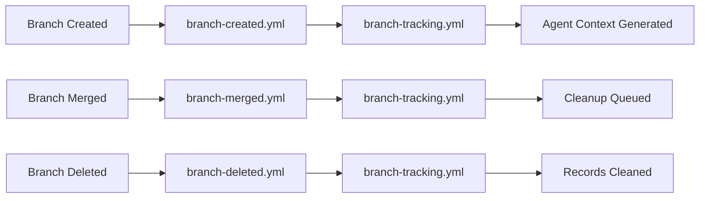
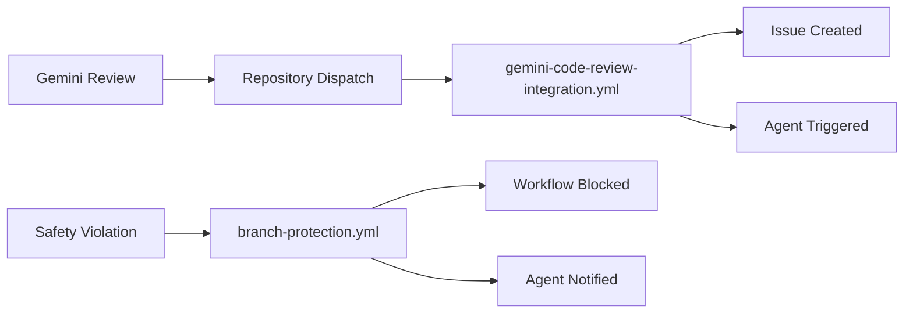

# GitHub Actions Workflow Infrastructure Guide

## Overview

This guide provides agents with essential information about the GitHub Actions workflow infrastructure that powers the Tuvens agentic development system. Understanding these workflows helps agents work effectively within the automated coordination system.

## Quick Reference

| Workflow | Purpose | Agent Impact |
|----------|---------|--------------|
| `gemini-code-review-integration.yml` | Processes Gemini feedback into GitHub issues with agent assignment | 🤖 Auto-assigns critical feedback to agents |
| `branch-tracking.yml` | Central coordination of branch lifecycle across repositories | 📊 Updates agent task visibility and coordination |
| `branch-created.yml` | Notifies central system of new branches | 🌿 Triggers agent context loading and task setup |
| `branch-merged.yml` | Processes branch merges and cleanup | 🔀 Updates task completion status and cleanup queue |
| `branch-deleted.yml` | Handles branch deletion notifications | 🗑️ Cleans up agent tracking and task records |
| `branch-protection.yml` | Enforces safety rules and naming conventions | 🛡️ Validates agent work against safety standards |
| `notify-repositories.yml` | Cross-repository change notifications | 📡 Coordinates multi-repo agent tasks |
| `vibe-coder-maintenance.yml` | Automated maintenance and health checks | 🔧 Maintains agent coordination infrastructure |

## The 5-Category Workflow System

### 1. Multi-Agent Coordination & Tracking System (5 workflows)
**Workflows**: `branch-tracking.yml`, `central-tracking-handler.yml`, `branch-created.yml`, `branch-deleted.yml`, `branch-merged.yml`, `gemini-code-review-integration.yml`

**Purpose**:
- Cross-repository synchronization - Tracks branch lifecycle events across all Tuvens repositories
- Agent coordination - Maintains a central registry of what agents are working on which branches  
- Session continuity - Ensures agents can pick up where others left off
- External feedback routing - Routes Gemini code review feedback to appropriate agents

**Value to Agentic Development**:
- ✅ Prevents conflicts - Agents know what others are doing
- ✅ Maintains context - Branch tracking provides session memory across agent interactions
- ✅ Enables collaboration - Multiple agents can coordinate on complex multi-repo tasks
- ✅ External integration - Automatically processes external code review feedback

### 2. AI Agent Safety & Governance (1 workflow)
**Workflows**: `branch-protection.yml`

**Purpose**:
- Enforces CLAUDE.md safety rules - Validates agents follow naming conventions and safety protocols
- Branch protection - Prevents agents from directly committing to protected branches
- Quality gates - Ensures infrastructure requirements are met before merges

**Value to Agentic Development**:
- ✅ Safety first - Prevents agents from making destructive changes
- ✅ Consistent patterns - Enforces standard agent behaviors across all repositories
- ✅ Quality control - Automated validation of agent work

### 3. Agent Context Generation (1 workflow)
**Workflows**: `auto-documentation.yml`

**Purpose**:
- Automatic documentation - Generates context documents from git history
- Agent onboarding - Provides new agent sessions with recent development context
- Development continuity - Maintains historical context for decision making

**Value to Agentic Development**:
- ✅ Session memory - Agents understand what happened in previous sessions
- ✅ Reduces redundancy - Agents don't repeat work already done
- ✅ Better decisions - Context-aware agents make more informed choices

### 4. Infrastructure Health & Maintenance (2 workflows)
**Workflows**: `infrastructure-validation.yml`, `vibe-coder-maintenance.yml`

**Purpose**:
- Continuous validation - Ensures all infrastructure remains operational
- Proactive maintenance - Creates maintenance issues before problems occur
- System health monitoring - Validates workflows, dependencies, and tools

**Value to Agentic Development**:
- ✅ Reliability - Catches issues before they impact agents
- ✅ Predictive maintenance - Prevents system degradation
- ✅ Tool confidence - Agents know their tools work correctly

### 5. Cross-Repository Notification (2 workflows)
**Workflows**: `notify-repositories.yml`, `notify-repositories-test.yml`

**Purpose**:
- Event propagation - Notifies related repositories of important changes
- Dependency management - Updates dependent systems when core changes occur
- System-wide coordination - Ensures all parts of Tuvens ecosystem stay synchronized

**Value to Agentic Development**:
- ✅ System coherence - Changes propagate across the entire ecosystem
- ✅ Reduced manual work - Automatic updates eliminate coordination overhead
- ✅ Consistency - All repositories maintain compatible states

## 🧠 Core Value Proposition

These workflows create a "nervous system" for AI agents providing:

1. **Memory** - Agents remember what happened across sessions
2. **Coordination** - Multiple agents can work together without conflicts  
3. **Safety** - Automated governance prevents destructive actions
4. **Context** - Agents understand the broader system state
5. **Reliability** - Infrastructure self-monitors and self-heals

## 🚨 Why Workflow Failures Matter

When these workflows fail:
- Agents lose session continuity
- Branch tracking becomes inconsistent  
- Safety validations don't run
- Cross-repository synchronization fails
- The entire multi-agent system becomes unreliable

**Critical**: Always investigate workflow failures immediately as they can cascade and affect all agent operations.

## Agent Integration Points

### Branch Tracking System
- **File**: `agentic-development/branch-tracking/active-branches.json`
- **Integration**: All workflows update this central tracking file
- **Agent Usage**: Check branch status, see related tasks, understand agent assignments

### CLAUDE.md Safety Integration
- **Validation**: `branch-protection.yml` enforces CLAUDE.md compliance
- **Safety Rules**: All workflows respect safety boundaries defined in CLAUDE.md
- **Agent Behavior**: Agents must follow CLAUDE.md rules; workflows will enforce them

### Agent Session Context
- **Context Loading**: Workflows prepare context for agent sessions from multiple sources
- **Task Coordination**: Branch tracking provides visibility into related agent work
- **Documentation**: Workflows maintain documentation that becomes agent context

### GitHub Issues Integration
- **Issue Creation**: `gemini-code-review-integration.yml` creates issues for agent work
- **Labeling**: Issues are automatically labeled with agent assignments and priorities
- **Status Tracking**: Issues link to branch tracking and workflow execution status

## Workflow Triggers and Dependencies

### Branch Lifecycle Triggers


### External Integrations


## Troubleshooting Guide

### Common Issues and Solutions

#### Workflow Not Triggering
**Symptoms**: Expected automation not happening, no workflow runs visible
**Causes**: 
- Repository dispatch event not sent correctly
- Workflow file syntax errors
- Token permission issues

**Solutions**:
```bash
# Check recent workflow runs
gh run list --limit 10

# View specific workflow runs  
gh run view [run-id] --log

# Test repository dispatch
gh api repos/tuvens/tuvens-docs/dispatches \
  --field event_type='test' \
  --field 'client_payload={}'
```

#### Branch Tracking Out of Sync
**Symptoms**: Branch tracking shows incorrect status, missing branches
**Causes**:
- Workflow execution failures
- Network issues during execution
- Concurrent updates causing conflicts

**Solutions**:
```bash
# Manually trigger branch tracking update
node agentic-development/scripts/update-branch-tracking.js --help

# Check branch tracking file consistency
cat agentic-development/branch-tracking/active-branches.json | jq .

# Reset branch tracking (if necessary)
git checkout HEAD -- agentic-development/branch-tracking/
```

#### Agent Session Not Triggered
**Symptoms**: Critical feedback doesn't trigger agent assignment
**Causes**:
- Feedback priority not meeting thresholds
- Agent assignment rules not matching file patterns
- Session triggering script failures

**Solutions**:
```bash
# Test feedback processing manually
node agentic-development/scripts/process-gemini-feedback.js \
  --payload='{"title":"test","description":"critical security issue"}'

# Check agent session logs
cat agentic-development/branch-tracking/agent-sessions.json | jq .

# Verify agent assignment rules in process-gemini-feedback.js
```

#### Safety Workflow Failures
**Symptoms**: PRs blocked, branch protection failures
**Causes**:
- Branch naming convention violations
- CLAUDE.md missing or invalid
- Attempts to commit to protected branches

**Solutions**:
```bash
# Check branch naming
./scripts/hooks/check-branch-naming.sh

# Validate CLAUDE.md
./scripts/hooks/validate-claude-md.sh

# Review safety rules
cat CLAUDE.md | grep -A 5 "Safety Rules"
```

### Debugging Workflow Execution

#### GitHub Actions Logs
```bash
# View recent workflow runs
gh run list --workflow=branch-tracking.yml

# Get detailed logs for specific run
gh run view [run-id] --log

# Download logs for offline analysis
gh run download [run-id]
```

#### Local Testing
```bash
# Test individual scripts locally
cd agentic-development/scripts/
node update-branch-tracking.js --help
node process-gemini-feedback.js --help
node trigger-agent-session.js --help

# Validate JSON files
cat branch-tracking/*.json | jq . > /dev/null && echo "Valid JSON"

# Check file permissions
ls -la branch-tracking/
```

#### Network and API Issues
```bash
# Test GitHub API connectivity
gh api user

# Check repository dispatch permissions
gh api repos/tuvens/tuvens-docs --jq .permissions

# Verify token scopes
gh auth status
```

## Best Practices for Agents

### Working with Workflows
1. **Understand Dependencies**: Know which workflows affect your work
2. **Monitor Status**: Check workflow runs when automation seems broken  
3. **Follow Safety Rules**: Expect and comply with branch protection workflows
4. **Use Context**: Leverage the context generated by workflow systems
5. **Report Issues**: Create GitHub issues when workflows consistently fail

### Integration Guidelines
1. **Branch Naming**: Follow `{agent}/{type}/{description}` convention
2. **CLAUDE.md Compliance**: Ensure safety file exists and is valid
3. **Issue Linking**: Reference issues that relate to your work
4. **Documentation Updates**: Keep documentation current as you work

### Debugging Approach
1. **Check Workflow Logs**: Start with GitHub Actions logs for recent runs
2. **Validate Local Files**: Ensure branch tracking files are consistent
3. **Test Manually**: Use provided scripts to test components individually
4. **Escalate Systematically**: Follow the troubleshooting guide step by step

## Integration with Agent Configuration

This workflow infrastructure integrates with agent configuration files in `agentic-development/desktop-project-instructions/agents/`. Each agent should:

1. **Reference this guide** in their configuration
2. **Understand workflow impacts** on their specific role
3. **Follow workflow-driven task assignment** 
4. **Report workflow issues** that affect their work

## Maintenance and Updates

### Regular Maintenance
- Workflow files are maintained by the **devops** agent
- Documentation updates are coordinated by **docs-orchestrator**
- Testing and validation are handled by **vibe-coder**

### Version Control
- All workflow changes go through PR review
- Safety-critical workflows require additional validation
- Documentation is updated with each workflow modification

### Monitoring
- Workflow execution is logged and monitored
- Performance metrics are tracked for optimization
- Issues are automatically created for persistent failures

---

**Last Updated**: 2025-08-08  
**Version**: 1.0  
**Maintained By**: Vibe Coder Agent  
**Review Process**: Multi-agent collaborative review (DevOps + Task Orchestrator + Gemini Code Assist)

*This guide is part of the Tuvens agentic development infrastructure. For questions or issues, create a GitHub issue with the `workflow-infrastructure` label.*