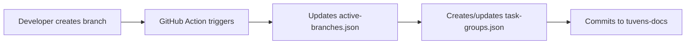
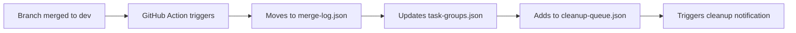

# Central Branch Tracking System

## Overview

This system tracks all active branches and worktrees across the Tuvens ecosystem, enabling cross-repository task coordination and automated cleanup.

## Architecture

### Central Index Location
```
tuvens-docs/
└── agentic-development/
    └── branch-tracking/
        ├── active-branches.json      # Current active branches
        ├── task-groups.json          # Related branches working on same task
        ├── merge-log.json            # Recently merged branches
        └── cleanup-queue.json        # Branches ready for cleanup
```

### Branch Lifecycle Events

#### 1. Branch Creation


#### 2. Branch Merge


## Data Structures

### active-branches.json
```json
{
  "lastUpdated": "2024-12-20T10:30:00Z",
  "generatedBy": "GitHub Actions",
  "tuvensStrategy": "develop->staging->main with change-type prefixes",
  "branches": {
    "tuvens-client": [
      {
        "name": "feature/cross-app-authentication-ui",
        "author": "ciarancarroll",
        "created": "2024-12-19T14:20:00Z",
        "lastActivity": "2024-12-20T09:15:00Z",
        "taskGroup": "cross-app-auth-epic",
        "status": "active",
        "worktree": "~/Code/Tuvens/tuvens-client/worktrees/feature-cross-app-authentication-ui",
        "agent": "svelte-dev",
        "relatedBranches": [
          "tuvens-api:feature/cross-app-authentication-api",
          "hi.events:feature/cross-app-authentication-laravel"
        ],
        "githubUrl": "https://github.com/tuvens/tuvens-client/tree/feature/cross-app-authentication-ui",
        "issues": ["tuvens-client#45", "tuvens-docs#12"]
      }
    ],
    "tuvens-api": [
      {
        "name": "feature/cross-app-authentication-api",
        "author": "ciarancarroll",
        "created": "2024-12-19T14:25:00Z", 
        "lastActivity": "2024-12-20T08:45:00Z",
        "taskGroup": "cross-app-auth-epic",
        "status": "active",
        "worktree": "~/Code/Tuvens/tuvens-api/worktrees/feature-cross-app-authentication-api",
        "agent": "node-dev",
        "relatedBranches": [
          "tuvens-client:feature/cross-app-authentication-ui",
          "hi.events:feature/cross-app-authentication-laravel"
        ],
        "githubUrl": "https://github.com/tuvens/tuvens-api/tree/feature/cross-app-authentication-api",
        "issues": ["tuvens-api#23"]
      }
    ]
  }
}
```

### task-groups.json
```json
{
  "cross-app-auth-epic": {
    "title": "Cross-App Authentication Implementation",
    "description": "Enable seamless authentication between Tuvens and Hi.Events",
    "coordinator": "ciarancarroll",
    "created": "2024-12-19T14:20:00Z",
    "status": "in-progress",
    "branches": {
      "tuvens-client": "feature/cross-app-authentication-ui",
      "tuvens-api": "feature/cross-app-authentication-api", 
      "hi.events": "feature/cross-app-authentication-laravel"
    },
    "agents": {
      "svelte-dev": "tuvens-client UI components and flows",
      "node-dev": "API endpoints and session management",
      "laravel-dev": "Hi.Events integration and validation"
    },
    "dependencies": [
      "tuvens-api branch must be merged before tuvens-client integration",
      "hi.events branch needed for end-to-end testing"
    ],
    "issues": [
      "tuvens-client#45",
      "tuvens-api#23", 
      "hi.events#12",
      "tuvens-docs#12"
    ],
    "documentation": [
      "tuvens-docs/implementation-guides/cross-app-authentication/"
    ]
  }
}
```

### merge-log.json
```json
{
  "recentMerges": [
    {
      "repository": "tuvens-client",
      "branch": "bug-fix/login-form-validation",
      "mergedAt": "2024-12-20T09:30:00Z",
      "mergedBy": "ciarancarroll",
      "targetBranch": "dev",
      "taskGroup": "auth-fixes",
      "cleanupEligible": true,
      "worktreePath": "~/Code/Tuvens/tuvens-client/worktrees/bug-fix-login-form-validation"
    }
  ]
}
```

## GitHub Actions Integration

### Branch Creation Webhook
```yaml
# .github/workflows/branch-created.yml (in each repo)
name: Branch Lifecycle - Created
on:
  create:
    branches:
      - '**'

jobs:
  notify-tuvens-docs:
    runs-on: ubuntu-latest
    steps:
      - name: Extract branch info
        id: branch_info
        run: |
          echo "branch=${GITHUB_REF#refs/heads/}" >> $GITHUB_OUTPUT
          echo "repo=${GITHUB_REPOSITORY#*/}" >> $GITHUB_OUTPUT
          echo "author=${GITHUB_ACTOR}" >> $GITHUB_OUTPUT

      - name: Update central tracking
        uses: peter-evans/repository-dispatch@v2
        with:
          token: ${{ secrets.TUVENS_DOCS_TOKEN }}
          repository: tuvens/tuvens-docs
          event-type: branch-created
          client-payload: |
            {
              "repository": "${{ steps.branch_info.outputs.repo }}",
              "branch": "${{ steps.branch_info.outputs.branch }}",
              "author": "${{ steps.branch_info.outputs.author }}",
              "created": "${{ github.event.head_commit.timestamp }}",
              "githubUrl": "${{ github.event.repository.html_url }}/tree/${{ steps.branch_info.outputs.branch }}"
            }
```

### Branch Merge Webhook
```yaml
# .github/workflows/branch-merged.yml (in each repo)  
name: Branch Lifecycle - Merged
on:
  pull_request:
    types: [closed]
    branches: [dev, test, stage, main]

jobs:
  notify-merge:
    if: github.event.pull_request.merged == true
    runs-on: ubuntu-latest
    steps:
      - name: Update tracking on merge
        uses: peter-evans/repository-dispatch@v2
        with:
          token: ${{ secrets.TUVENS_DOCS_TOKEN }}
          repository: tuvens/tuvens-docs
          event-type: branch-merged
          client-payload: |
            {
              "repository": "${{ github.repository.name }}",
              "branch": "${{ github.event.pull_request.head.ref }}",
              "targetBranch": "${{ github.event.pull_request.base.ref }}",
              "mergedBy": "${{ github.event.pull_request.merged_by.login }}",
              "mergedAt": "${{ github.event.pull_request.merged_at }}",
              "pullRequestUrl": "${{ github.event.pull_request.html_url }}"
            }
```

### Central Tracking Handler
```yaml
# tuvens-docs/.github/workflows/branch-tracking.yml
name: Central Branch Tracking
on:
  repository_dispatch:
    types: [branch-created, branch-merged, branch-deleted]

jobs:
  update-tracking:
    runs-on: ubuntu-latest
    steps:
      - uses: actions/checkout@v3
        with:
          token: ${{ secrets.GITHUB_TOKEN }}

      - name: Setup Node.js
        uses: actions/setup-node@v3
        with:
          node-version: '18'

      - name: Update branch tracking
        run: |
          node agentic-development/scripts/update-branch-tracking.js \
            --event-type="${{ github.event.action }}" \
            --payload='${{ toJson(github.event.client_payload) }}'

      - name: Commit tracking updates
        run: |
          git config --local user.email "action@github.com"
          git config --local user.name "GitHub Action"
          git add agentic-development/branch-tracking/
          git commit -m "Update branch tracking: ${{ github.event.action }} from ${{ github.event.client_payload.repository }}" || exit 0
          git push
```

## Local Integration

### Enhanced /start-session Command
```bash
#!/bin/bash
# Enhanced /start-session with central tracking

AGENT="$1"
TASK_DESCRIPTION="$2"
CURRENT_REPO=$(basename $(pwd))

# Load central tracking
TRACKING_DIR="./tuvens-docs/agentic-development/branch-tracking"
ACTIVE_BRANCHES="$TRACKING_DIR/active-branches.json"

# Check for related task groups
if [ -f "$TRACKING_DIR/task-groups.json" ]; then
    echo "🔍 Checking for related task groups..."
    RELATED_TASKS=$(jq -r --arg desc "$TASK_DESCRIPTION" '
        to_entries[] | 
        select(.value.title | test($desc; "i")) | 
        "\(.key): \(.value.title)"
    ' "$TRACKING_DIR/task-groups.json")
    
    if [ -n "$RELATED_TASKS" ]; then
        echo "📋 Found related task groups:"
        echo "$RELATED_TASKS"
        echo ""
        read -p "Join existing task group? (y/N): " -n 1 -r
        if [[ $REPLY =~ ^[Yy]$ ]]; then
            TASK_GROUP=$(echo "$RELATED_TASKS" | head -n1 | cut -d: -f1)
            echo "Joining task group: $TASK_GROUP"
        fi
    fi
fi

# Create branch with proper naming
BRANCH_NAME="$AGENT/${TASK_DESCRIPTION// /-}" 
WORKTREE_PATH="./worktrees/$BRANCH_NAME"

# Create worktree
git worktree add "$WORKTREE_PATH" -b "$BRANCH_NAME"

# Update central tracking locally (will be synced by GitHub Action)
echo "📊 Updating central branch tracking..."
node tuvens-docs/agentic-development/scripts/update-local-tracking.js \
    --action="create" \
    --repo="$CURRENT_REPO" \
    --branch="$BRANCH_NAME" \
    --agent="$AGENT" \
    --task-group="$TASK_GROUP" \
    --worktree="$(pwd)/$WORKTREE_PATH"

# Show related branches for context
if [ -n "$TASK_GROUP" ]; then
    echo "🔗 Related branches in this task group:"
    jq -r --arg group "$TASK_GROUP" '
        .[$group].branches | 
        to_entries[] | 
        "  \(.key): \(.value)"
    ' "$TRACKING_DIR/task-groups.json"
fi

echo "✅ Branch created: $BRANCH_NAME"
echo "📁 Worktree: $WORKTREE_PATH"
echo "🤖 Agent: $AGENT"
echo "📝 Task Group: ${TASK_GROUP:-"none"}"
```

### Cleanup Command
```bash
#!/bin/bash
# cleanup-merged-branches

TRACKING_DIR="./tuvens-docs/agentic-development/branch-tracking"
CLEANUP_QUEUE="$TRACKING_DIR/cleanup-queue.json"

if [ ! -f "$CLEANUP_QUEUE" ]; then
    echo "No cleanup queue found"
    exit 0
fi

echo "🧹 Branches eligible for cleanup:"
jq -r '.[] | "  \(.repository):\(.branch) (merged \(.mergedAt))"' "$CLEANUP_QUEUE"

read -p "Proceed with cleanup? (y/N): " -n 1 -r
if [[ $REPLY =~ ^[Yy]$ ]]; then
    # Process each branch in cleanup queue
    jq -c '.[]' "$CLEANUP_QUEUE" | while read -r branch_data; do
        repo=$(echo "$branch_data" | jq -r '.repository')
        branch=$(echo "$branch_data" | jq -r '.branch')
        worktree=$(echo "$branch_data" | jq -r '.worktreePath')
        
        if [ -d "$worktree" ]; then
            echo "🗑️  Removing worktree: $worktree"
            git worktree remove "$worktree" --force
        fi
        
        echo "🗑️  Deleting remote branch: $repo/$branch"
        cd "../$repo"
        git push origin --delete "$branch" 2>/dev/null || echo "Branch already deleted remotely"
        cd - > /dev/null
    done
    
    # Clear cleanup queue
    echo "[]" > "$CLEANUP_QUEUE"
    echo "✅ Cleanup complete"
fi
```

## Benefits of This System

### Cross-Repository Coordination
- **Task Groups**: See all related branches working on the same feature
- **Agent Awareness**: Know which agents are working on what
- **Dependencies**: Track which branches need to be merged in order

### Automated Lifecycle Management
- **Real-time Updates**: GitHub Actions update central index immediately
- **Cleanup Automation**: Merged branches automatically queued for cleanup
- **Conflict Prevention**: Agents can see related work before creating duplicates

### Enhanced Development Experience
```bash
# Agent can see the full picture
/start-session svelte-dev "authentication-ui"

# Output:
# 🔍 Checking for related task groups...
# 📋 Found related task groups:
# cross-app-auth-epic: Cross-App Authentication Implementation
# 
# 🔗 Related branches in this task group:
#   tuvens-api: feature/cross-app-authentication-api (node-dev)
#   hi.events: feature/cross-app-authentication-laravel (laravel-dev)
#
# 💡 Coordination needed:
#   - API endpoints must be complete before UI integration
#   - Hi.Events validation needed for testing
```

## Logical Issues Identified & Solutions

### 1. **Race Conditions**
**Problem**: Multiple developers creating branches simultaneously
**Solution**: Use GitHub's atomic operations and optimistic locking in JSON updates

### 2. **Network Partitions**
**Problem**: Local tracking out of sync with central index
**Solution**: Sync command to reconcile differences, conflict resolution strategies

### 3. **Branch Naming Conflicts**
**Problem**: Two agents creating similar branch names
**Solution**: Include timestamp or unique ID in branch names, validation in /start-session

### 4. **Stale Worktree References**
**Problem**: Worktrees deleted locally but still tracked centrally
**Solution**: Periodic cleanup job that validates worktree existence

### 5. **Cross-Repository Dependencies**
**Problem**: Branch A in repo 1 depends on branch B in repo 2
**Solution**: Explicit dependency tracking in task-groups.json with validation

This system transforms the multi-repository development from chaotic to orchestrated. Does this architecture address your vision?