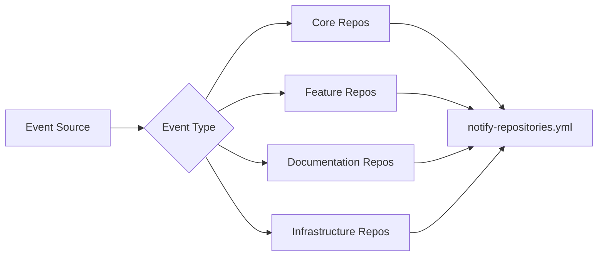

# Cross-Repository Notification

## Overview

The cross-repository notification system propagates important events and changes across all repositories in the Tuvens ecosystem, ensuring system-wide coordination and consistency.

## System Components (2 workflows)

**Workflows**: `notify-repositories.yml`, `notify-repositories-test.yml`

## Core Functions

### Event Propagation
- Notifies related repositories of important changes and updates
- Broadcasts system-wide events across the entire Tuvens ecosystem
- Ensures critical information reaches all affected repositories
- Maintains event ordering and delivery guarantees

### Dependency Management
- Updates dependent systems when core changes occur
- Manages cascading updates across repository dependencies
- Coordinates version updates and compatibility requirements
- Handles dependency conflicts and resolution strategies

### System-Wide Coordination
- Ensures all parts of Tuvens ecosystem stay synchronized
- Coordinates multi-repository development workflows
- Manages cross-repository feature rollouts and deployments
- Maintains consistency across distributed system components

## Value to Agentic Development

- ✅ **System coherence** - Changes propagate across the entire ecosystem
- ✅ **Reduced manual work** - Automatic updates eliminate coordination overhead
- ✅ **Consistency** - All repositories maintain compatible states
- ✅ **Reliability** - Event delivery guarantees prevent synchronization issues

## Cross-Repository Integration Points

### Event Distribution
- **Repository Dispatch**: Uses GitHub repository dispatch events for notifications
- **Webhook Integration**: Integrates with external systems through webhooks
- **API Coordination**: Coordinates with external APIs and services
- **Message Queuing**: Ensures reliable event delivery across repositories

### Dependency Synchronization
- **Version Management**: Coordinates version updates across repositories
- **Configuration Sync**: Synchronizes configuration changes across systems
- **Schema Updates**: Propagates database and API schema changes
- **Security Updates**: Distributes security patches across the ecosystem

### Multi-Repository Workflows
- **Feature Coordination**: Coordinates feature development across repositories
- **Release Management**: Manages coordinated releases across multiple repositories
- **Testing Coordination**: Coordinates integration testing across repositories
- **Deployment Synchronization**: Ensures consistent deployment states

## Detailed Workflow Functions

### notify-repositories.yml
- **Purpose**: Cross-repository change notifications
- **Triggers**: Repository events, manual dispatch, scheduled synchronization
- **Actions**: Sends notifications to related repositories, updates coordination state
- **Agent Impact**: Coordinates multi-repo agent tasks, ensures system consistency
- **Notification Scope**: All production repositories in the Tuvens ecosystem

### notify-repositories-test.yml
- **Purpose**: Test version of cross-repository notifications  
- **Triggers**: Test events, development changes, validation runs
- **Actions**: Tests notification delivery, validates coordination logic
- **Agent Impact**: Tests multi-repo coordination without affecting production
- **Testing Scope**: Development and staging repositories only

## Event Types and Routing

### Core System Events
- **Configuration Changes**: Updates to core system configurations
- **Security Updates**: Critical security patches and vulnerability fixes
- **API Changes**: Breaking or significant API modifications
- **Schema Updates**: Database or data structure changes

### Development Events
- **Branch Events**: Significant branch creation, merging, or deletion
- **Release Events**: New releases, hotfixes, or rollback events
- **Agent Events**: Agent assignment changes, task completions
- **Integration Events**: CI/CD pipeline status and deployment events

### Infrastructure Events
- **Service Updates**: Infrastructure service changes or outages
- **Dependency Updates**: Critical dependency updates or vulnerabilities
- **Performance Issues**: System performance degradation or optimization
- **Monitoring Alerts**: Critical system monitoring alerts and notifications

## Event Routing Rules

### Repository Targeting


### Priority Routing
- **Critical Events**: Immediate delivery to all repositories
- **High Priority**: Delivery within 5 minutes to affected repositories
- **Normal Priority**: Delivery within 30 minutes via batch processing
- **Low Priority**: Daily batch delivery for non-critical updates

## Best Practices for Agents

### Working with Cross-Repository Events
1. **Monitor Notifications**: Stay aware of cross-repository events affecting your work
2. **Coordinate Changes**: Consider multi-repository impact when making changes
3. **Test Integration**: Verify changes work across affected repositories
4. **Document Dependencies**: Clearly document cross-repository dependencies
5. **Handle Event Failures**: Gracefully handle notification delivery failures

### Cross-Repository Development
1. **Check Dependencies**: Verify related repositories before making breaking changes
2. **Coordinate Releases**: Align releases across dependent repositories
3. **Test Integration Points**: Validate integration after cross-repository changes
4. **Communicate Changes**: Ensure other agents know about cross-repository impacts
5. **Follow Event Patterns**: Use established patterns for cross-repository communication

### Event Handling
1. **Process Notifications**: Handle incoming repository notifications appropriately
2. **Validate Events**: Verify event data before taking action
3. **Handle Failures**: Implement retry logic for failed event processing
4. **Log Events**: Maintain event logs for debugging and audit purposes

## Event Payload Structure

### Standard Event Format
```json
{
  "event_type": "repository_update",
  "source_repository": "tuvens/tuvens-docs",
  "target_repositories": ["tuvens/repo-a", "tuvens/repo-b"],
  "timestamp": "2025-08-19T16:00:00Z",
  "priority": "high",
  "payload": {
    "change_type": "configuration",
    "affected_files": ["config/app.yml"],
    "breaking_changes": false,
    "migration_required": false
  },
  "metadata": {
    "triggered_by": "devops-agent",
    "workflow_run_id": 12345,
    "correlation_id": "uuid-here"
  }
}
```

### Event Processing Logic
```javascript
// Pseudo-code for event processing
async function processEvent(event) {
  if (event.priority === 'critical') {
    await immediateProcessing(event);
  } else {
    await queueForBatchProcessing(event);
  }
  
  await updateCoordinationState(event);
  await notifyAffectedAgents(event);
  await logEventForAudit(event);
}
```

## Troubleshooting Cross-Repository Issues

### Event Delivery Failures
**Symptoms**: Repositories out of sync, missing notifications, stale data
**Causes**:
- Network connectivity issues
- API rate limits exceeded
- Target repository unavailable

**Solutions**:
```bash
# Check recent notification workflows
gh run list --workflow=notify-repositories.yml --limit 10

# Manually trigger notifications
gh workflow run notify-repositories.yml --ref main

# Test repository connectivity
gh repo view tuvens/target-repo
```

### Repository Synchronization Issues
**Symptoms**: Inconsistent states across repositories, version mismatches
**Causes**:
- Failed event processing
- Partial update completion
- Conflicting concurrent changes

**Solutions**:
```bash
# Check synchronization status
gh api repos/tuvens/tuvens-docs/dispatches

# Verify repository states
for repo in repo-a repo-b; do
  gh api repos/tuvens/$repo/contents/config/app.yml | jq .sha
done

# Force synchronization
gh workflow run notify-repositories.yml --ref main \
  -f event_type=force_sync -f priority=high
```

### Event Processing Errors
**Symptoms**: Events logged but not processed, error logs in workflows
**Causes**:
- Malformed event payloads
- Processing logic errors
- External service failures

**Solutions**:
```bash
# Review workflow logs for errors
gh run list --workflow=notify-repositories.yml --status=failure
gh run view [run-id] --log

# Validate event payload format
cat event-payload.json | jq . && echo "Valid JSON"

# Test event processing manually
node scripts/test-event-processing.js --event-file event-payload.json
```

### API Rate Limiting
**Symptoms**: Delayed event delivery, rate limit errors in logs
**Causes**:
- High event volume
- Concurrent workflow executions
- Inefficient API usage

**Solutions**:
```bash
# Check current rate limit status
gh api rate_limit

# Review event batching configuration
cat .github/workflows/notify-repositories.yml | grep -A 5 "batch"

# Optimize event delivery timing
# Adjust workflow schedules to distribute API usage
```

## Monitoring and Observability

### Event Metrics
- Event delivery success rates and latency
- Repository synchronization lag times
- Error rates and failure patterns
- API usage and rate limit consumption

### Cross-Repository Health
- Repository consistency validation
- Dependency relationship mapping
- Integration test results across repositories
- Performance impact of cross-repository operations

### Alert Thresholds
- Critical event delivery failures trigger immediate alerts
- Repository synchronization lag exceeding thresholds
- High error rates in event processing
- API rate limit approaching exhaustion

---

**Last Updated**: 2025-08-19  
**Version**: 2.0 - Extracted from main workflow guide  
**Maintained By**: DevOps Agent  

*This document is part of the Tuvens workflow infrastructure. For cross-repository coordination issues, create a GitHub issue with the `cross-repo-sync` label.*