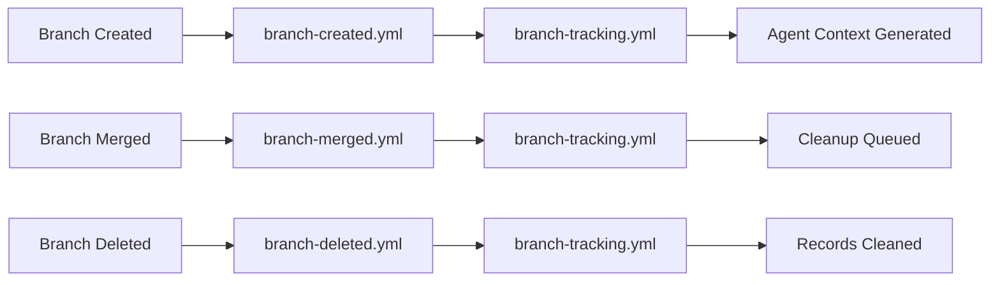
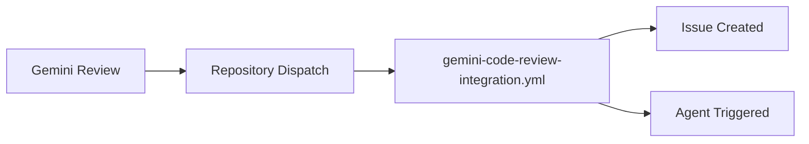

# Multi-Agent Coordination & Tracking System

## Overview

The multi-agent coordination and tracking system ensures seamless collaboration between AI agents across multiple repositories. This system maintains a central registry of agent activities, tracks branch lifecycles, and routes external feedback to appropriate agents.

## System Components (6 workflows)

**Workflows**: `branch-tracking.yml`, `central-tracking-handler.yml`, `branch-created.yml`, `branch-deleted.yml`, `branch-merged.yml`, `gemini-code-review-integration.yml`

## Core Functions

### Cross-Repository Synchronization
- Tracks branch lifecycle events across all Tuvens repositories
- Maintains consistency between related repositories
- Ensures all repositories stay in sync with core changes

### Agent Coordination  
- Maintains a central registry of what agents are working on which branches
- Prevents conflicts between agents working on related tasks
- Provides visibility into agent activities across the ecosystem

### Session Continuity
- Ensures agents can pick up where others left off
- Preserves context across agent handoffs
- Maintains historical context for decision making

### External Feedback Routing
- Routes Gemini code review feedback to appropriate agents
- Automatically creates GitHub issues for critical feedback
- Triggers agent sessions based on feedback priority and file patterns

## Value to Agentic Development

- ✅ **Prevents conflicts** - Agents know what others are doing
- ✅ **Maintains context** - Branch tracking provides session memory across agent interactions
- ✅ **Enables collaboration** - Multiple agents can coordinate on complex multi-repo tasks
- ✅ **External integration** - Automatically processes external code review feedback

## Agent Integration Points

### Branch Tracking System
- **File**: `agentic-development/branch-tracking/active-branches.json`
- **Integration**: All workflows update this central tracking file
- **Agent Usage**: Check branch status, see related tasks, understand agent assignments

### GitHub Issues Integration
- **Issue Creation**: `gemini-code-review-integration.yml` creates issues for agent work
- **Labeling**: Issues are automatically labeled with agent assignments and priorities
- **Status Tracking**: Issues link to branch tracking and workflow execution status

### Agent Session Context
- **Context Loading**: Workflows prepare context for agent sessions from multiple sources
- **Task Coordination**: Branch tracking provides visibility into related agent work
- **Documentation**: Workflows maintain documentation that becomes agent context

## Workflow Triggers and Dependencies

### Branch Lifecycle Triggers


### External Integrations


## Detailed Workflow Functions

### branch-tracking.yml
- **Purpose**: Central coordination of branch lifecycle across repositories
- **Triggers**: Repository dispatch events from other workflows
- **Actions**: Updates central tracking file, maintains agent assignments
- **Agent Impact**: Updates agent task visibility and coordination

### branch-created.yml  
- **Purpose**: Notifies central system of new branches
- **Triggers**: Branch creation events
- **Actions**: Triggers agent context loading and task setup
- **Agent Impact**: Initializes agent work environment for new branches

### branch-merged.yml
- **Purpose**: Processes branch merges and cleanup
- **Triggers**: Branch merge events  
- **Actions**: Updates task completion status and cleanup queue
- **Agent Impact**: Marks agent tasks as completed, triggers cleanup

### branch-deleted.yml
- **Purpose**: Handles branch deletion notifications
- **Triggers**: Branch deletion events
- **Actions**: Cleans up agent tracking and task records
- **Agent Impact**: Removes completed tasks from agent visibility

### gemini-code-review-integration.yml
- **Purpose**: Processes Gemini feedback into GitHub issues with agent assignment
- **Triggers**: Repository dispatch with Gemini review payload
- **Actions**: Creates GitHub issues, assigns to appropriate agents
- **Agent Impact**: Auto-assigns critical feedback to agents

### central-tracking-handler.yml
- **Purpose**: Handles central tracking system updates and maintenance
- **Triggers**: Scheduled runs and repository dispatch events
- **Actions**: Maintains tracking file consistency, performs cleanup
- **Agent Impact**: Ensures reliable coordination data for all agents

## Best Practices for Agents

### Working with the Coordination System
1. **Check Branch Status**: Always check `active-branches.json` before starting work
2. **Respect Agent Assignments**: Avoid working on branches assigned to other agents
3. **Update Progress**: Ensure your work updates branch tracking appropriately
4. **Follow Session Context**: Use context provided by coordination workflows

### Integration Guidelines  
1. **Branch Naming**: Follow `{agent}/{type}/{description}` convention for tracking
2. **Issue Linking**: Reference issues that relate to your coordinated work
3. **Status Updates**: Keep GitHub issues current as coordination progresses
4. **Documentation**: Update documentation as coordination patterns evolve

## Troubleshooting Coordination Issues

### Branch Tracking Out of Sync
**Symptoms**: Branch tracking shows incorrect status, missing branches
**Causes**:
- Workflow execution failures
- Network issues during execution
- Concurrent updates causing conflicts

**Solutions**:
```bash
# Manually trigger branch tracking update
node agentic-development/scripts/update-branch-tracking.js --help

# Check branch tracking file consistency
cat agentic-development/branch-tracking/active-branches.json | jq .

# Reset branch tracking (if necessary)
git checkout HEAD -- agentic-development/branch-tracking/
```

### Agent Session Not Triggered
**Symptoms**: Critical feedback doesn't trigger agent assignment
**Causes**:
- Feedback priority not meeting thresholds
- Agent assignment rules not matching file patterns
- Session triggering script failures

**Solutions**:
```bash
# Test feedback processing manually
node agentic-development/scripts/process-gemini-feedback.js \
  --payload='{"title":"test","description":"critical security issue"}'

# Check agent session logs
cat agentic-development/branch-tracking/agent-sessions.json | jq .

# Verify agent assignment rules in process-gemini-feedback.js
```

---

**Last Updated**: 2025-08-19  
**Version**: 2.0 - Extracted from main workflow guide  
**Maintained By**: DevOps Agent  

*This document is part of the Tuvens workflow infrastructure. For issues, create a GitHub issue with the `multi-agent-coordination` label.*