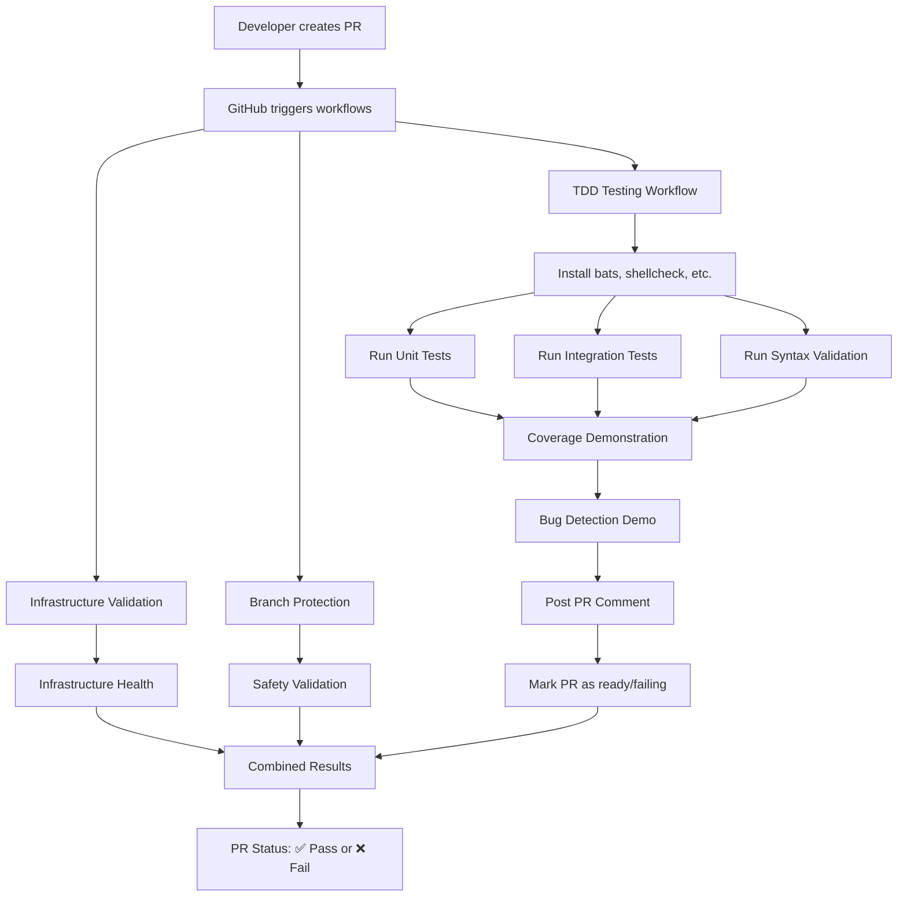

# TDD Test Execution Schedule

This document explains exactly **when** and **how** the TDD tests run in the development workflow.

## Test Execution Triggers

### 1. **Pull Request Creation** (Primary - Immediate Feedback)

**Trigger:** As soon as a PR is opened targeting `dev`, `test`, `stage`, or `main`

**Workflows that run:**
- `.github/workflows/tdd-testing.yml` - Dedicated TDD test suite
- `.github/workflows/infrastructure-validation.yml` - Existing infrastructure tests (includes TDD)
- `.github/workflows/branch-protection.yml` - Safety validation

**What gets tested:**
- ✅ All 130+ TDD unit and integration tests
- ✅ Syntax validation for all shell scripts
- ✅ Bug-catching demonstration
- ✅ Complete coverage verification
- ✅ Pre-commit hook validation
- ✅ Branch naming and safety checks

**Timeline:** ~3-5 minutes after PR creation

**Benefits:**
- Immediate feedback before code review
- Catches issues before human reviewer sees them
- Prevents broken code from entering review process

### 2. **Push to Protected Branches** (Merge Validation)

**Trigger:** Push/merge to `dev`, `test`, `stage`, or `main`

**What happens:**
- Same comprehensive test suite as PR creation
- Additional infrastructure validation
- Full system health checks

**Timeline:** Runs during merge process

### 3. **Manual Testing** (Developer Control)

**Local Development:**
```bash
# Before committing
npm run pre-commit          # Quick syntax + linting

# Before creating PR  
npm run test-pr             # Full TDD suite + linting

# Specific test types
npm run test:tdd            # All TDD tests
npm run test:tdd:unit       # Unit tests only
npm run test:tdd:syntax     # Syntax validation only
```

**Manual Workflow Dispatch:**
- Go to GitHub Actions → "TDD Testing Framework" 
- Click "Run workflow"
- Choose test suite type (unit/integration/syntax/all)

### 4. **Scheduled Testing** (Health Monitoring)

**Trigger:** Daily at 2 AM UTC (via existing infrastructure-validation.yml)

**Purpose:**
- Detect environment drift
- Validate against dependency updates
- Ensure long-term stability

## Test Execution Flow



## Test Results Visibility

### 1. **GitHub PR Interface**
- ✅/❌ Status checks appear immediately
- Detailed logs available by clicking check details
- Automatic PR comment with test summary

### 2. **GitHub Actions Tab**
- Complete workflow execution logs
- Downloadable test artifacts
- Matrix execution for different test types

### 3. **PR Comments** 
Automatic comment posted with:
- Test execution summary (✅ Pass/❌ Fail)
- Coverage statistics (28/28 scripts tested)
- Bug detection verification
- Ready-for-review status

**Example PR Comment:**
```markdown
## 🧪 TDD Test Results for PR #123

### ✅ Test Execution Summary
- Complete test suite executed on PR creation
- 100% script coverage maintained  
- Bug-catching capability demonstrated
- All test suites passed: Unit, Integration, Syntax validation

### 📊 Coverage Details  
- Total Scripts: 28
- Scripts Tested: 28 (100%)
- Test Files: 8 comprehensive test suites
- Total Tests: 130+ individual test functions

**Status**: All TDD tests passed ✅
**Ready for review and merge**
```

## Failure Handling

### When Tests Fail:
1. **PR Status**: Marked as failing ❌
2. **Merge Prevention**: Cannot merge until fixed
3. **Automatic Issue Creation**: GitHub issue auto-created with failure details ⚡
4. **Agent Notification**: Issue assigned to responsible agent
5. **Detailed Logs**: Available in GitHub Actions
6. **Local Debugging**: `npm run test-pr` reproduces issues

### **🆕 Automatic Issue Creation System**

**When tests fail, the system automatically:**
- Creates GitHub issue with detailed failure information
- Assigns to the responsible agent (extracted from branch name)
- Includes reproduction steps and fix guidance
- Prevents duplicate issues for the same branch/PR
- Auto-closes issues when tests subsequently pass

**Issue Title Examples:**
- `TDD Test Failure: PR #123 - vibe-coder`
- `TDD Test Failure: vibe-coder/feature/branch-name - vibe-coder`

**Agent Workflow:**
1. Tests fail → Issue auto-created
2. Repository maintainer: "Check issues, fix test failures"
3. Agent fixes problems → Commits to same branch
4. Tests re-run → Issue auto-closes when passing

See [Automatic Issue Creation Guide](./automatic-issue-creation.md) for detailed documentation.

### Common Failure Scenarios:
- **Syntax Error**: Script has bash syntax error
- **Missing Test**: New script added without test
- **Bug Detection**: Test catches real bug in code
- **Environment Issue**: Missing dependency or file

### Resolution Process:
1. Check GitHub Actions logs for specific failure
2. Run `npm run test-pr` locally to reproduce
3. Fix the issue (add test, fix syntax, etc.)
4. Commit fix - tests re-run automatically
5. PR status updates to ✅ when fixed

## Performance Optimization

**Fast Feedback Strategy:**
- Syntax validation runs first (fastest)
- Unit tests run in parallel matrix
- Integration tests run separately
- Full demonstration only on successful test completion

**Caching:**
- Node.js dependencies cached
- Tool installations cached where possible
- Test artifacts cached for debugging

## Developer Workflow Integration

### Recommended Development Process:
1. **Before coding**: `npm run test:tdd:syntax` (validate existing)
2. **During development**: Write tests first (TDD approach)
3. **Before committing**: `npm run pre-commit` (quick validation)
4. **Before PR**: `npm run test-pr` (full validation)
5. **After PR creation**: Check GitHub Actions status
6. **Address failures**: Fix issues, tests re-run automatically

### IDE Integration:
- VS Code: Configure tasks.json to run `npm run test:tdd`
- Terminal: Alias `alias tdd="npm run test:tdd"`
- Git hooks: Pre-commit hooks run `npm run pre-commit`

## Monitoring and Maintenance

### Test Health Monitoring:
- Daily scheduled runs detect environment issues
- Coverage reports track test completeness
- Performance monitoring for execution time

### Updating Tests:
- New scripts require corresponding tests
- Test failures indicate breaking changes
- Regular review of test effectiveness

---

**Summary**: Tests run **immediately on PR creation** providing fast feedback, with comprehensive validation throughout the development lifecycle.