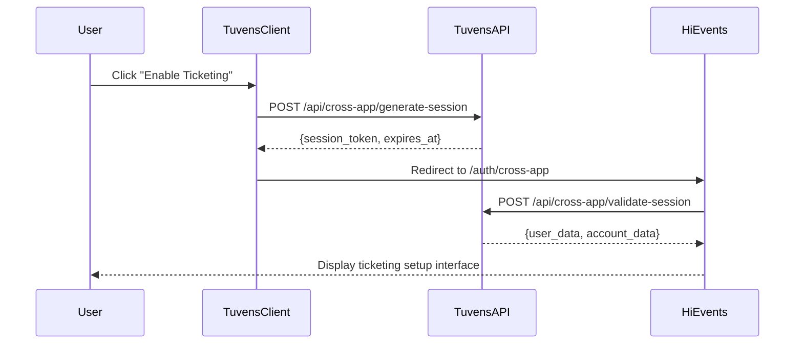
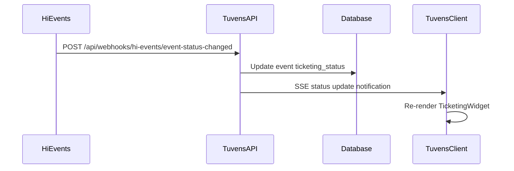
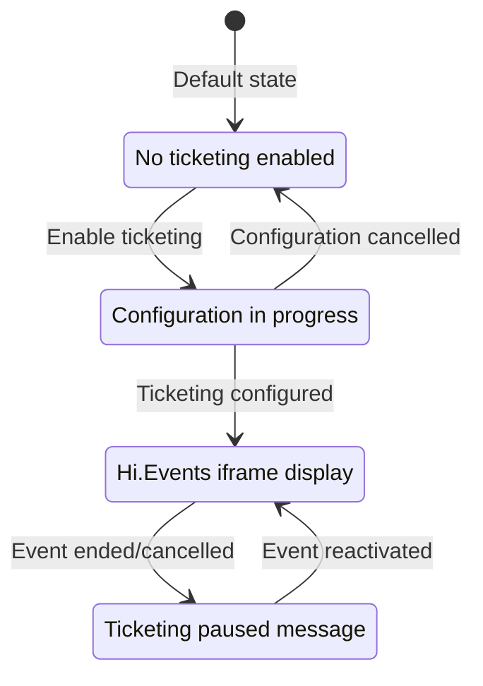

# Hi.Events Integration Architecture

## 🏗️ System Architecture Overview

The Hi.Events integration provides seamless ticketing functionality for Tuvens events through a comprehensive cross-app authentication system and real-time status updates.

## 📊 Architecture Diagram

```
┌─────────────────┐    Session Token    ┌─────────────────┐    Webhook Status   ┌─────────────────┐
│   tuvens-client │ ──────────────────► │   tuvens-api    │ ◄─────────────────── │   hi.events     │
│                 │                     │                 │                     │                 │
│ • Event Pages   │                     │ • Cross-App API │                     │ • Ticketing UI  │
│ • Widget UI     │                     │ • Session Mgmt  │                     │ • Auth Services │
│ • SSE Updates   │                     │ • Webhook Hdlr  │                     │ • Event Mgmt    │
└─────────────────┘                     └─────────────────┘                     └─────────────────┘
         │                                       │                                       │
         │ Widget Iframe                         │ Database Updates                      │
         └───────────────────────────────────────┼───────────────────────────────────────┘
                                                 ▼
                              ┌─────────────────────────────────┐
                              │          PostgreSQL             │
                              │                                 │
                              │ • crossAppSession table        │
                              │ • event table (enhanced)       │
                              │ • user table                   │
                              │ • contactData JSON fields      │
                              └─────────────────────────────────┘
```

## 🔧 Component Architecture

### 1. Frontend Architecture (tuvens-client)

#### **Core Components**
```typescript
src/lib/
├── components/ticketing/
│   ├── AddTicketingSection.svelte     # Enable ticketing UI
│   └── TicketingWidget.svelte         # Dynamic ticketing widget
├── services/
│   └── crossAppAuth.ts                # Cross-app authentication service
├── stores/
│   └── eventUpdatesStore.ts           # Real-time updates infrastructure
└── apis/hievents/
    └── extendedEventTypes.ts          # Enhanced event types with ticketing
```

#### **Integration Points**
- **Event Pages**: `/src/routes/event/[id]/+page.svelte`
- **API Routes**: `/src/routes/api/cross-app/generate-session/+server.ts`
- **Widget States**: Dynamic display based on ticketing status

### 2. Backend Architecture (tuvens-api)

#### **Cross-App Authentication Endpoints**
```typescript
POST /api/cross-app/generate-session     # Generate secure session tokens
POST /api/cross-app/validate-session     # Validate session and return user data
GET  /api/cross-app/user-accounts        # Return user accounts for session
POST /api/cross-app/validate-permission  # Validate user permissions
```

#### **Webhook System**
```typescript
POST /api/webhooks/hi-events/event-status-changed  # Hi.Events status updates
```

#### **File Structure**
```typescript
src/
├── controllers/api/
│   ├── cross-app/                     # Cross-app authentication
│   └── webhooks/hi-events/            # Webhook handlers
├── services/
│   ├── cross-app/                     # Authentication services
│   └── webhooks/hi-events/            # Webhook processing
└── database/
    └── migrations/                    # crossAppSession table
```

### 3. Hi.Events Architecture (hi.events)

#### **Authentication Services**
```php
app/Services/
├── SecureCrossAppAuthService.php      # Session validation with main backend
└── SecureCrossAppAuthMiddleware.php   # Request authentication middleware
```

#### **Frontend Services**
```typescript
resources/js/
├── CrossAppAuthService.ts             # Cross-app authentication client
└── tuvensAuth.ts                      # Tuvens-specific authentication
```

#### **Database Integration**
- External user ID mappings
- Account synchronization
- Event linking and management

## 🔄 Integration Flow Architecture

### 1. **Ticketing Enablement Flow**


### 2. **Real-Time Status Update Flow**


### 3. **Widget Display Flow**


## 🗄️ Database Architecture

### 1. **Cross-App Session Management**
```sql
CREATE TABLE crossAppSession (
    id SERIAL PRIMARY KEY,
    sessionToken VARCHAR(255) UNIQUE NOT NULL,
    userId INTEGER NOT NULL REFERENCES users(id),
    accountId INTEGER NOT NULL REFERENCES users(id),
    appId VARCHAR(50) NOT NULL,
    expiresAt TIMESTAMP NOT NULL,
    createdAt TIMESTAMP DEFAULT NOW(),
    lastUsed TIMESTAMP,
    sysCreated TIMESTAMP DEFAULT NOW(),
    sysModified TIMESTAMP DEFAULT NOW()
);
```

### 2. **Enhanced Event Structure**
```typescript
interface EventWithHiEvents {
    // Legacy fields (backward compatibility)
    hasTicketing?: boolean;
    hiEventsEventId?: number;
    
    // New ticketing fields
    ticketing_enabled: boolean;
    ticketing_status: 'setup' | 'active' | 'inactive';
    hi_events_event_id: number;
    hi_events_event_url: string;
    
    // Enhanced contactData JSON
    contactData: {
        hiEventsEventId?: number;
        hiEventsStatus?: string;
        hiEventsLastUpdated?: string;
        // ... other contact data
    }
}
```

## 🔒 Security Architecture

### 1. **Authentication Layers**
```typescript
// Layer 1: JWT Authentication (User-facing)
Authorization: Bearer <jwt_token>

// Layer 2: Shared Secret (Backend-to-backend)
x-shared-secret: <HI_EVENTS_SHARED_SECRET>

// Layer 3: HMAC Webhook Signature
x-hi-events-signature: sha256=<hmac_signature>
```

### 2. **Token Security**
- **Session Tokens**: Cryptographically secure 32-byte random tokens
- **Expiration**: 15-minute sliding window
- **Single Use**: Tokens consumed on successful validation
- **Timing Safety**: Constant-time comparison for signatures

### 3. **Data Protection**
- **HTTPS Only**: All communications encrypted in transit
- **Input Validation**: Comprehensive validation of all payloads
- **Rate Limiting**: Protection against abuse
- **Audit Logging**: Complete trail of all operations

## 🌐 Network Architecture

### 1. **Cross-Origin Configuration**
```typescript
// CORS Configuration
{
    origin: ['https://tickets.tuvens.com'],
    credentials: true,
    methods: ['GET', 'POST'],
    allowedHeaders: [
        'Authorization', 
        'Content-Type', 
        'X-Session-Token', 
        'X-Shared-Secret'
    ]
}
```

### 2. **Environment Configuration**
```bash
# Backend Environment Variables
CROSS_APP_SHARED_SECRET=<secure-random-secret>
CROSS_APP_SESSION_EXPIRY=900
HI_EVENTS_SHARED_SECRET=<shared-with-hi-events>
HI_EVENTS_DOMAIN=tickets.tuvens.com

# Frontend Environment Variables
NEXT_PUBLIC_HI_EVENTS_URL=https://tickets.tuvens.com
NEXT_PUBLIC_API_BASE_URL=https://api.tuvens.com
```

## 📡 Real-Time Update Architecture

### 1. **Server-Sent Events (SSE)**
```typescript
// Client-side SSE connection
const eventSource = new EventSource('/api/events/updates');
eventSource.onmessage = (event) => {
    const update = JSON.parse(event.data);
    if (update.type === 'ticketing_status_changed') {
        updateTicketingWidget(update.eventId, update.status);
    }
};
```

### 2. **Webhook to SSE Bridge**
```typescript
// Webhook handler triggers SSE updates
export async function handleHiEventsWebhook(payload) {
    // Update database
    await updateEventTicketingStatus(eventId, status);
    
    // Trigger SSE notification
    sseManager.broadcast('ticketing_status_changed', {
        eventId,
        status,
        timestamp: new Date().toISOString()
    });
}
```

## 🎯 Widget Architecture

### 1. **Dynamic Widget States**
```svelte
<!-- TicketingWidget.svelte -->
{#if ticketing_status === 'active'}
    <iframe src="{hi_events_event_url}/embed" />
    <a href="{hi_events_event_url}" target="_blank">View Tickets</a>
{:else if ticketing_status === 'setup'}
    <div class="setup-progress">Configuration in progress...</div>
{:else if ticketing_status === 'inactive'}
    <div class="inactive-notice">Ticketing is currently paused</div>
{:else}
    <div class="alternative-registration">
        <!-- Alternative registration methods -->
    </div>
{/if}
```

### 2. **Widget Performance**
- **Lazy Loading**: Widgets load only when visible
- **Caching**: Event status cached with TTL
- **Fallback**: Graceful degradation if Hi.Events unavailable
- **Responsive**: Mobile-first responsive design

## 🚀 Deployment Architecture

### 1. **Production Environment**
```bash
# Load Balancer
├── Tuvens Frontend (Vercel)
├── Tuvens API (Railway/Heroku)
└── Hi.Events Platform (Independent)

# Database
└── PostgreSQL (Managed service)
```

### 2. **Monitoring Points**
- **Authentication Success Rate**: Track session generation/validation
- **Webhook Delivery**: Monitor Hi.Events webhook reliability
- **Widget Performance**: Track loading times and errors
- **Database Health**: Monitor session table growth and cleanup

## 🔍 Testing Architecture

### 1. **Unit Testing**
- **Frontend Components**: Svelte Testing Library
- **Backend Services**: Jest/Vitest with mocks
- **Authentication Logic**: Comprehensive token validation tests

### 2. **Integration Testing**
- **Cross-App Flow**: End-to-end authentication testing
- **Webhook Processing**: Real payload testing
- **Database Operations**: Transaction integrity tests

### 3. **E2E Testing**
- **User Journeys**: Complete ticketing enablement flow
- **Error Scenarios**: Network failures and recovery
- **Performance Testing**: Load testing for concurrent users

This architecture provides a robust, scalable, and secure foundation for the Hi.Events integration, enabling seamless ticketing functionality while maintaining system integrity and user experience.